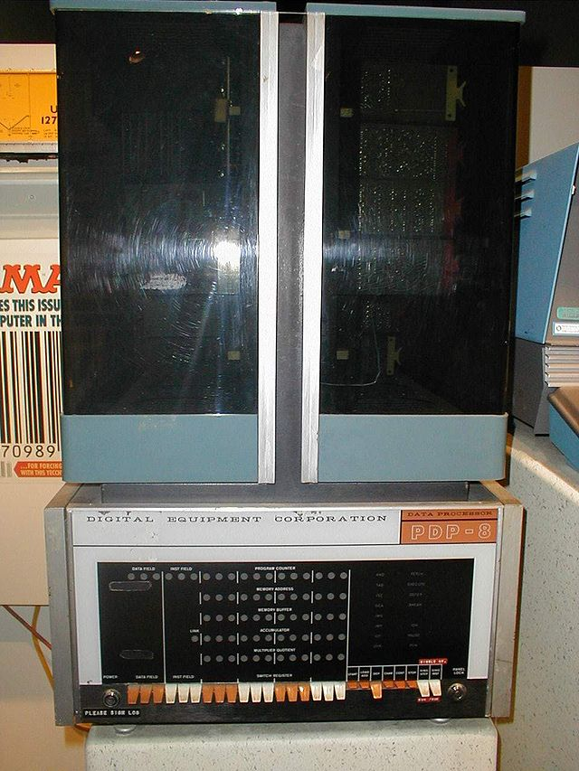

.. include:: ../global.rst

.. index:: integrated circuit

The Third Generation
=====================================

.. sidebar:: Integrated Circuit

    .. image:: Images/ICs.jpg
        :alt: Integrated Circuit
        :width: 200
        
    Integrated circuits combine multiple transistors into one compact package.
    
Jack Kilby of Texas Instruments invented the **integrated circuit** in 1958. Integrated circuits (ICs) combine many transistors into a single package; compared to individual transistors, they consume less power and can be packed in much tighter. Early ICs consisted of only a handful of transistors, but now days integrated circuits can be made with billions of transistors in the space of a fingernail.

.. index:: Third Generation

The ability to pack more computational power into less space heralded a new generation of computers. This **Third Generation**, built with integrated circuits, were even smaller more powerful and cheaper than the Second Generation. Instead of building all the logic for a computer in terms of individual transistors, integrated circuits allowed designers to work with more abstract logical building blocks. A new class of computer, the minicomputer, was created. Though still large by today's standards, minicomputers were significantly less expensive than the large mainframe computers previously available and brought computers into even more businesses.

This generation also saw the introduction of many features we now take for granted. Keyboards and displays were deveoped during during this period to facilitate real time interaction with computers - prior machines had to be fed a job and left to run it with little in the way of feedback provided until the job was complete. :ref:`Operating systems <operating systems>` were developed that allowed multiple programs and users to interact with the machine at once. 

   
   ..
   
   The PDP machines of the third generation were enormously influential - much early computer science was done on these machines

.. quick_attribution:: Wikipedia 