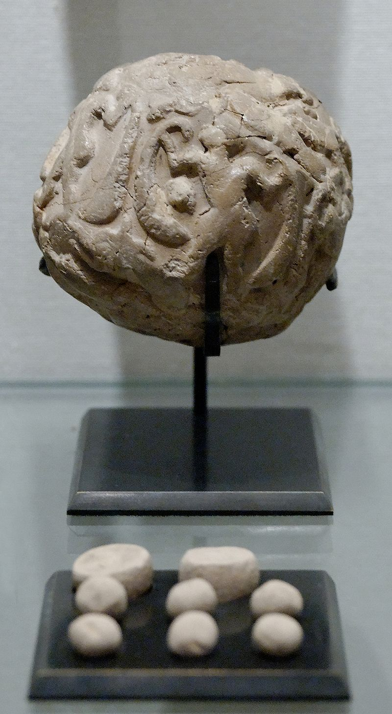
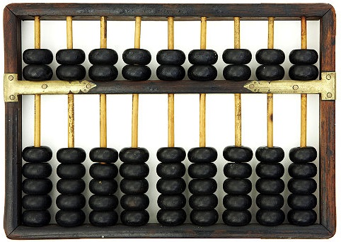

.. include:: ../global.rst

.. index:: 
    double: computer; history, pre

Prehistory
====================

Devices have been used to aid computation for thousands of years. The earliest known counting devices are clay tokens that were in use before 4000 BC. A given token might represent one sheep or ten sheep. To represent a count of 32 sheep, you would take three 10-sheep tokens and two 1-sheep tokens and seal them in a clay container.

   
   © Marie-Lan Nguyen / Wikimedia Commons
   
   Counting stones
   
   
By about 2500 BC, counting devices had been abstracted away from counting a particular thing and abacuses first appeared in Sumeria. These devices rely on the user moving beads or stones to represent numbers and to do arithmetic on them. Since then, many other forms of reckoning boards or tables have been invented. In a medieval European counting house, a checkered cloth would be placed on a table, and markers moved around on it according to certain rules, as an aid to calculating sums of money.

   
   Image courtesy of Computer History Museum.
   
   An abacus

.. sidebar:: The Antikythera Mechanism

    The ancient Greeks used complex devices to compute the timing of astrological events Antikythera mechanism and the astrolabe from ancient Greece. The **Antikythera mechanism** was a clockwork device of complexity that would not be seen again until the 14th century.
    
    `Wikipedia <http://en.wikipedia.org/wiki/Antikythera_mechanism>`_

.. index:: Pascaline, Antikythera Mechanism
.. index:: 
    single: Leibniz, Gotfried
    single: Pascal, Blaise
    
In the 1600s, the first mechanical calculators were developed. A teenager named Blaise Pascal (later to become into a famous mathematician) was one of their inventors. Pascal began to work on his calculator in 1642, when he was only 19 years old. He had been assisting his father, who worked as a tax commissioner, and sought to produce a device which could reduce some of his workload. The device he built, called the **Pascaline** could do addition and subtraction including automatically carrying from one place to the next. Many other mathematicians of the 17th century tried their hand at building their own calculators, including `Gotfried Leibniz <http://en.wikipedia.org/wiki/Gottfried_Leibniz>`_ who described a machine that would be implemented using :ref:`binary numbers <binary>`.

.. container:: inlinegroup

    .. figure:: Images/Pascaline.jpg
       :alt: Abacus
       :figwidth: 45%
       
       Image courtesy of Computer History Museum.
       
       The Pascaline
       
    .. figure:: Images/Leibniz_Binary.jpg
       :alt: Abacus
       :figwidth: 45%
    
       ..
       
       Libniz's notes on binary numbers
   

.. quick_attribution:: Wikipedia