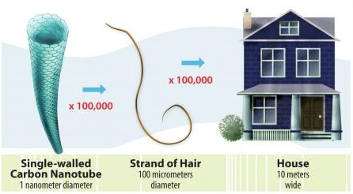

.. include:: ../global.rst

.. index:: moore's law

End of Moore's Law?
=========================================

Although it is hard to underestimate the degree to which computation has changed modern life, there are limits to what we can do with modern computers and new barriers to progress on the horizon. We have discussed problems that are proven to be unsolvable by any computer, and those that have no polynomial time solution and thus are unsolvable in practical terms on a modern computer. In addition to those algorithmic limits, physical limits are increasingly affecting our ability to build faster computers.

.. sidebar:: How Big? 

    \ `This cool animation <http://htwins.net/scale2/>`__ allows you to explore the microscopic world. (Hint: you'll find transistors at about :math:`{10}^{-7}` meters)

Moore's Law has served well as a predictor of the growth of the limits of computational power. By relentlessly shrinking the size of computational components we have been able to build more complex and faster processors. But the exponential growth of computer power predicted by Moore's Law may be close to an end. Modern transistors are manufactured at a size of about 20 nanometers - or 1/5000th of the size of a human hair. At this scale, the gate in a transistor the blocks or allows current is only about 100 atoms wide. 

    
    `Image by US Dept. of Energy <http://www.nano.gov/nanotech-101/what/nano-size>`__

    A transistor is 20 nm or 1/5000th the size of a human hair.

Somewhere around the year 2020 Moore's Law predicts we will be engineering transistors at about 5 nm in size. At this point, it is expected that the basic transistor design that we have used for decades will no longer work; at smaller sizes electrons find it easier and easier to "jump" from one side of a silicon switch to the other even when it is off, making it impossible to distinguish 1 and 0. Thus we will not be able to just shrink current designs any more, but will need completely new strategies and materials for building switches at small scale. Materials like `carbon nanotubes <http://www.technologyreview.com/news/528601/ibm-commercial-nanotube-transistors-are-coming-soon/>`__, `graphene <http://www.cnn.com/2013/10/02/tech/innovation/graphene-quest-for-first-ever-2d-material/>`__ and `phosphorene <http://www.nature.com/news/phosphorene-excites-materials-scientists-1.14668>`__ are being researched as possible replacements for silicon. Not only can materials like these be built in sheets a few atoms thick, they are more efficient conductors, potentially allowing for chips that run much faster.

Researchers in labs have already built transistors as small as a single atom, though we are a long way from being able to build a processor with them - currently they need to be cooled to close to -400° F to operate.

.. youtube:: ue4z9lB5ZHg
    :height: 315
    :width: 560

