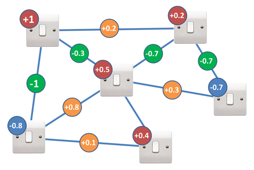

.. include:: ../global.rst

.. index:: quantum computing

Quantum Computing
=========================================

Modern physics has two separate models for how the universe works: **general relativity** which predicts how large scale objects interact and **quantum mechanics** which predicts the actions of sub-atomic particles. When we start working on the scale of single atoms, we leave the realm of physics that we are used to and enter the quantum world where things work in some mind-bending ways:

* Quantum objects can be in a `superposition <http://en.wikipedia.org/wiki/Quantum_superposition>`__ of states: they simultaneously exist in multiple possible states (like both on and off) until that state is observed at which point they "collapse" into just one state.

* Quantum objects can be `entangled <http://en.wikipedia.org/wiki/Quantum_entanglement>`__: when an action is taken on one particle of an entangled pair it instantly can affect the other particle, even if they are on opposite sides of the universe.

* Quantum objects can `tunnel <http://en.wikipedia.org/wiki/Quantum_tunnelling>`__: passing through materials that are theoretically solid.

Scientists are working on exploiting these behaviors to produce a new kind of computer, the **Quantum computer** (video set to stop at 1:43, feel free to watch the rest if you want):

.. youtube:: CMdHDHEuOUE
    :height: 315
    :width: 560
    :start: 0 
    :end: 103

    
So how exactly do they work and why are they more powerful? By entangling particles that are in a superposition of two possible states, we can make a system that tests many states at one time:

.. youtube:: g_IaVepNDT4
    :height: 315
    :width: 560

Say you are trying to solve an optimization problem that looks like the picture below. Since there are 6 switches, there are :math:`2^6 = 64` possible states that a classical computer would have to check one by one. A quantum computer with 6 qubits exists in every possible configuration of the switches at one time. If there were 200 switches in the problem, a classical computer would have to check :math:`2^{200} = 1.61 \times {10}^{60}` possible states one by one. A quantum computer with 200 qubits could check all those states simultaneously. 

    
    `Image by D-Wave Systems <http://www.dwavesys.com/tutorials/background-reading-series/quantum-computing-primer>`__
  
    Lightswitch optimization problem. Each switch can be on (1) or off (-1). A score is computed by: 
    
    1. Multiplying each switch by its red or blue multiplier  
    2. Multiplying each green or orange circle by the value of the switches it connects 
    3. Adding up the value from steps 1 and 2  
 
Quantum computers are probabilistic - each time you run a simulation of a problem, you get an answer that may be correct. "Programming" a quantum computer involves setting up the quantum system so that the correct answer is the one most likely to appear. But since there is a chance that any particular run of the system produces an incorrect answer, obtaining confidence in your answer requires running multiple simulations until the pattern of results makes it statistically clear which answer is the correct one. But even if the simulation must be run dozens or hundreds of times, it has th potential to be much faster than a classical computer checking trillions of trillions of possible answers.

This final video is about one of the earliest quantum computations - the factoring of 15 into 3 x 5 and getting the correct answer 48% of the time. While that may not sound too impressive, it is the first step on the road that might make cryptography algorithms like RSA easy to crack. (Video set to play only a segment from the middle, but feel free to watch the rest.)  
  
.. youtube:: Yl3o236gdp8 
    :height: 315
    :width: 560
    :start: 249 
    :end: 480

