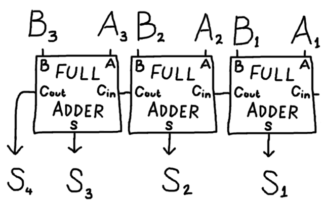

.. include:: ../global.rst

Adding Numbers with Logic
============================

To do mathematics, a computer needs to think of the problem as a set of Boolean outputs and inputs. For example, if a computer is adding two 1-bit binary numbers, there are two inputs (each of the bits). The answer in binary can be 0, 1, or :math:`10_2` (two) - it will thus take two bits to represent. The circuit below "adds" the two inputs and produces either 00, 01, or 10 as appropriate:

.. raw:: html

        <iframe src="../_static/simcir/simcir.html?circuits/HalfAdder.xml" style="border: 0px; width: 600px; height: 325px;"></iframe>

Notice that each output (the 2s column and the 1s column) functions independently. The 2s output answers the logical question "Are both the inputs ON?" (AND gate) - if so, we should have indicate that the answer has a 2 in it. The 1s output answers the question "Is only one of the inputs ON?" (EOR gate - remember EOR is another name for XOR) - if so, the binary answer has a 1. The answer to those logical questions does the same work as counting the number of inputs that are on and expressing the answer as a binary number!

The truth table for this circuit would have two output columns and look like the one shown below. Notice that there are two ways to get the output 01 (the number 1) - either have the first input on and second off or vice verse.

.. raw:: html
    
        <table border="0" class="truth-table table">
        <colgroup>
        <col width="25%">
        <col width="25%">
        <col width="25%">
        <col width="25%">
        </colgroup>
        <thead valign="bottom">
        <tr class="row-odd"><th class="head">Input 1</th>
        <th class="head">Input 2</th>
        <th class="head">2s</th>
        <th class="head">1s</th>
        </tr>
        </thead>
        <tbody valign="top">
        <tr class="row-even"><td>0</td>
        <td>0</td>
        <td class="output">0</td>
        <td>0</td>
        </tr>
        <tr class="row-odd"><td>0</td>
        <td>1</td>
        <td class="output">0</td>
        <td>1</td>
        </tr>
        <tr class="row-even"><td>1</td>
        <td>0</td>
        <td class="output">0</td>
        <td>1</td>
        </tr>
        <tr class="row-odd"><td>1</td>
        <td>1</td>
        <td class="output">1</td>
        <td>0</td>
        </tr>
        </tbody>
        </table>
        
    
.. important:: 

    Everything a computer does is in terms of answering logical questions. Doing math, modifying an image, recognizing speech, playing music, etc... all at some level are represented as logical questions the computer can process using logic gates.
    
The circuit shown above is known as a **half adder**. To add larger numbers, we need a **full adder** - a full adder is two half adders merged together with an OR that take three inputs. Two of the inputs are current values being added; the third input is whether or not there is a carry coming in from the previous column. The two outputs indicate the answers to the questions "does this column have a 1 in the answer?" and "do we need to carry a 1 to the next column?". 

.. raw:: html

        <iframe src="../_static/simcir/simcir.html?circuits/FullAdder.xml" style="border: 0px; width: 600px; height: 325px;"></iframe>
        
        
To add large numbers, multiple full adders are chained together - one full adder is used for each binary digit in the number. An abstracted view of adding two 3-digit binary numbers using three full adders is shown below.

        
    `Image © Iain McDonald <http://lifebeyondfife.com/before-you-learn-to-program/>`_
    
    Each adder takes in two inputs representing the two corresponding digits in the numbers being added (A and B) as well as the carry from the previous adder(Cin). 
    
    Each outputs the answer to "does the sum have a 1 in this column?" (the S output) and "do we carry a 1 into the next column's full adder?" (the Cout output).
 