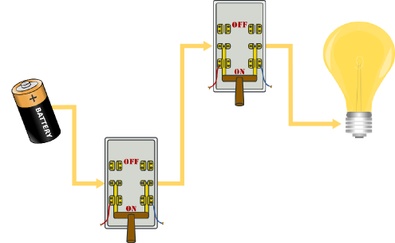

.. include:: ../global.rst

.. index::
    pair: Logic Gate; AND

The AND Gate
============================

By changing the way wires run between our switches (the inputs) and the light (output), we can perform different Boolean operations. The circuit below demonstrates the Boolean rule **AND**. Notice that because there is one pathway through both switches from the battery to the light bulb, both switches must be in the on position to light the bulb:

If either switch is off, that stops the current and the output is 0 (off):

.. container:: inlinegroup

    .. image:: Images/switchesAnd1.png
        :width: 45%

    .. image:: Images/switchesAnd2.png
        :width: 45%

What happens if both switches are off? If the first switch is off, the current is stopped there - it doesn't really matter what state the second one is in, we know the output will be 0. Once again we can express this as a truth table. Note that we have the same four possible sets of inputs that we had for the OR gate: 00, 01, 10, 11 - any truth table describing a two input circuit will always have those four possible inputs. What is different for the AND gate is the outputs produced by each input - it outputs a 1 only when both inputs are 1:

.. rst-class:: truth-table

    .. table:: Truth table for AND
    
        =============   =============   =============     
        Input 1         Input 2         Output 
        =============   =============   =============  
        0               0               0
        0               1               0
        1               0               0
        1               1               1
        =============   =============   ============= 
    
Once again, the 1's and 0's can be represent any Boolean (true/false) information. For instance, we could express the logic for determining whether or not a student got a B with this rule: "if your grade is greater than or equal to 80 AND your grade is less than 90, then you have a B". The AND combines two true/false ideas ("your grade is > or = to 80", "your grade is < 90") into one result ("you have a B"). If either of the two facts is false (your grade is less 80 or it is 90 or above), then you do not have a B.
