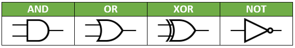

.. include:: ../global.rst

.. index:: circuits

Circuits
============================

Every circuit in a computer is made by wiring together switches (transistors) so they implement logic gates. These logic gates are used to store information, do math, make comparisons, as well as everything else a computer can do.

The diagrams for these circuits are drawn using the symbols shown below. Traditionally, the inputs to a gate come from the left, and the output comes out of the right side. That is why two lines are going into every gate but NOT... every other gate requires two inputs.

    ..

Key features:

* AND has a flat left side and is rounder, OR bends in on the left and is pointier
* XOR looks just like OR but with an extra line behind it
* NOT has a little circle at the tip of a triangle

Below is an **OR** gate being used in a circuit. The power is wired to two push-button switches that function as the inputs to the circuit. The inputs can be turned off, in which case they do not transmit power, or on, in which case they allow power through (try clicking on the buttons inside **Input1** and **Input2** - the center will turn a different color when they are "on"). Those inputs feed into the left side of the **OR** gate. The output of the **OR** gate comes out of the right side and travels to the **Output**. If either one of the two Inputs is set to on (or both are), the Output should be on.

.. simcir::

    {
        "width":600,
        "height":250,
        "showToolbox":false,
        "devices":[
        {"type":"DC","id":"dev0","x":120,"y":104,"label":"Power"},
        {"type":"Toggle","id":"dev1","x":184,"y":64,"label":"Input1","state":{"on":false}},
        {"type":"Toggle","id":"dev2","x":184,"y":136,"label":"Input2","state":{"on":false}},
        {"type":"OR","id":"dev4","x":336,"y":104,"label":"OR"},
        {"type":"LED","id":"dev5","x":408,"y":104,"label":"Output"}
        ],
        "connectors":[
        {"from":"dev1.in0","to":"dev0.out0"},
        {"from":"dev2.in0","to":"dev0.out0"},
        {"from":"dev4.in0","to":"dev1.out0"},
        {"from":"dev4.in1","to":"dev2.out0"},
        {"from":"dev5.in0","to":"dev4.out0"}
        ]
    }