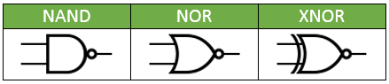
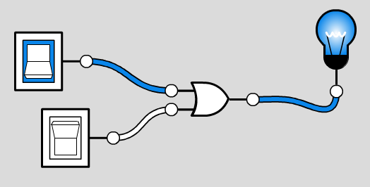

.. include:: ../global.rst

.. index:: circuits

Circuits
============================

Every circuit in a computer is made by wiring together switches (transistors) so they implement logic gates. These logic gates are used to store information, do math, make comparisons, and everything else a computer can do.

The diagrams for these circuit are drawn using the symbols shown below. Traditionally, the inputs to a gate come from the left, and the output comes out of the right side. That is why there are two lines going into every gate but NOT... every other gate requires two inputs.

.. figure:: Images/BasicGates.png

    ..
    
    Key features:
    
    * AND has a flat left side and is rounder, OR bends in on the left and is pointier
    * XOR looks just like OR but with an extra line behind it
    * NOT has a little circle at the tip of a triangle

The negated gates are the same as the basic gates, but with the little NOT circle at the output. This helps make clear that the behavior of something like NAND is really the same as an AND gate with a NOT after it.
    

Below is an **OR** gate being used in a full circuit. There are two inputs (light switches) that feed into the left side of the gate. The output of the **OR** gate comes out of the right side and travels to the light bulb.

    ..
    
    An OR gate connected to two inputs. The output is on Because the top input is on.
