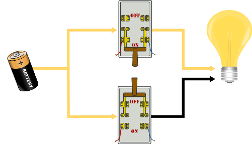
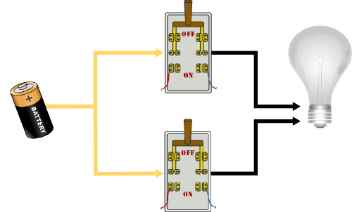

.. include:: ../global.rst

.. index::
    pair: Logic Gate; OR

The OR Gate
============================

The basic building block of computers is the switch - in modern computers a transistor - able to turn a signal on or off. A computer does all its work with these switches, manipulating the binary information that represents data. These switches are combined in various ways to produce what are known as **logic gates**. Logic gates take one or more input signals and produce an output based on the current input.  

As a first example, consider two switches that are implemented in parallel - electricity can pass from a battery to light bulb if either switch is on. *(Note that this is a highly simplified version of how electrical circuits really work)*  In the figure below, the electricity is being routed through the top switch that is on. The fact that the bottom switch is off does not change the fact that power can reach the bulb.

If only the bottom switch is on, or if both switches are on, the power can still reach the bulb to light it:

.. container:: inlinegroup

    .. image:: Images/switchesOr2.png
        :width: 45%

    .. image:: Images/switchesOr4.png
        :width: 45%

The only way the light bulb will not be on is if both switches are in the off position:

.. index:: 
    single: Boole, George

.. sidebar:: George Boole
    
    `George Boole <http://en.wikipedia.org/wiki/George_Boole>`_ invented the rules of logic that computers use in the 1800s. The term **Boolean** logic gets its name from him.
    
    .. image:: Images/George_Boole_color.jpg

.. index:: truth table, Boolean logic

These switches are demonstrating the Boolean logic rule of **OR**. The OR rule says that if either input (switch) is on, the output (light) is on. This can be summarized in terms of a **truth table**. A truth table shows each possible set of input and the output those input produces. 

For the circuit shown above, we can think of the top switch as Input 1 and the bottom switch as Input 2. We will call on "1" and off "0". There are four possible sets of inputs for the two switches: 00 - both off, 10 - top on, 01 - bottom on, 11 - both on. In every situation but 00, the output is on (1). The truth table below shows those four possibilities:

.. rst-class:: truth-table

    .. table:: Truth table for OR
    
        =============   =============   =============     
        Input 1         Input 2         Output 
        =============   =============   =============  
        0               0               0
        0               1               1
        1               0               1
        1               1               1
        =============   =============   ============= 

Although the computer will only think in terms of 1 and 0, those can stand for any piece of information that has a true/false or yes/no answer. For example, maybe our two inputs represent "Is it raining right now?" and "Is rain forecast for later?" and our output represents "Bring an umbrella". The logical rule **OR** is appropriate to decide if we need to have an umbrella with us; if it is raining now, or if it is expected to rain later (or if it is raining now and is expected to rain later) then we need an umbrella.

