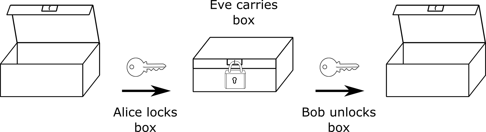
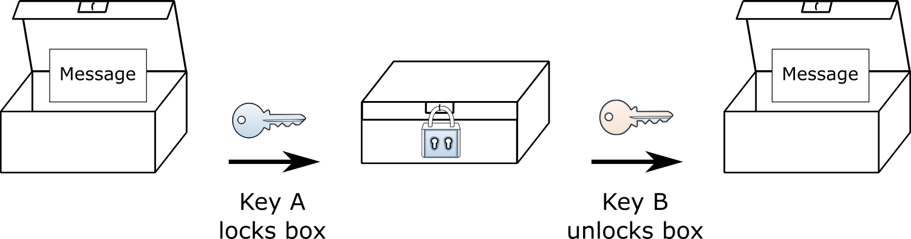
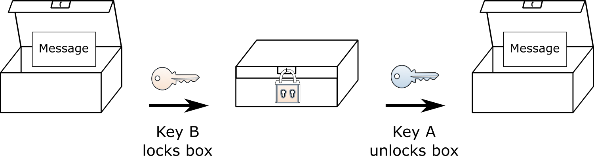
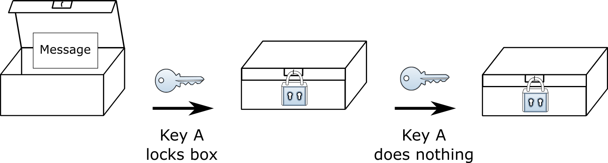
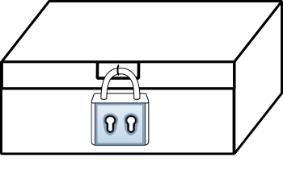

.. include:: ../global.rst

.. index:: asymmetric cryptography

Two Kinds of Cryptography
=========================================

To resolve this problem of identifying who we are talking to on the internet, we first need to talk about a new kind of cryptography algorithm.

The traditional cryptography we looked at while studying the Diffie-Hellman algorithm is **symmetric cryptography**, meaning that the same key (or secret) is used to encrypt the message and decrypt the message. If the encryption key is *"shift every letter by 8"*, the decryption key will also be *"shift every letter by 8"* (only in the other direction).

It is like a lock on a box where there is one key used to both seal the lock and later to unlock it. If two people, Alice and Bob, are the only two with a key for the lock, they can use the box to pass secret messages. Alice can write a message, lock the box, then safely give the box to Eve who promises to deliver it to Bob.

Alice knows that only Bob has the right key to unlock the box, so Eve can't snoop on the message. And when Bob gets the box, he can be sure that whatever message is locked inside of it had to be written by Alice - Eve could not have opened the box to put a forged message in.

.. pseudo_h3:: Asymmetric Cryptography
    :class: underlined

In **asymmetric cryptography**, the key used to encrypt a message is different than the key used to decrypt it. It is like a box where the lock has two keys: key A and key B. The mechanism on the box works such that when the lock is sealed using key A, you have to use key B to open it.

When the box is sealed using key B, you have to use key A to unlock it.

There is one more important feature of this hypothetical lock - you cannot use the same key to unlock the box that was used to lock it. If you seal it using key A, key A cannot be used to unlock the box. Nor can key B unlock the box if it was locked with B.

Let us imagine Alice has key A and Bob has key B. They could use the keys and this special box to securely communicate; if Alice locks the box, she knows only Bob can unlock it. If Bob gets a box that his key opens, he knows Alice must have locked it using her key. If Bob locks a message in the box using his key the roles are reversed: Bob knows only Alice will be able to read it and Alice will know that Bob sent it.

  ..

  This box was locked with A. It must come from someone with key A and can only be opened by key B.

These properties of asymmetric cryptography will be critical for the algorithm we are going to use to authenticate machines on the internet - for making sure that when Alice wants to talk to Bob (or you to Wells Fargo) that Eve is not pretending to be one of the parties.
