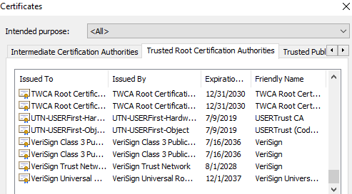
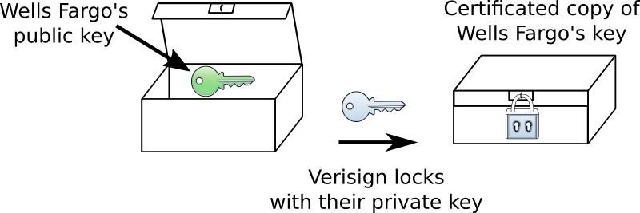

.. include:: ../global.rst

.. index:: certification authorities

.. index:: signing, digital

Certificate Authorities
=========================================

We have a chicken and egg problem: We can't trust any computer that we connect to over the internet unless we have its public key. But we can't trust a public key if we get it over the internet.

To get around this problem, computers and web browsers come with a list of public keys already built in. Large tech companies like Microsoft and companies that specialize in internet security like Verisign provide their public key to the makers of web browsers and other software. We trust that the makers of the software have verified that the public key really belongs to the company it is being used for - that the "Microsoft key" really does belong to Microsoft - and thus, we can trust those keys. (This is a good reason to be careful about where you download your web browser from - if you download a browser like Chrome from a dodgy website it may have been doctored to include new public keys!).

So our computers can trust certain web servers because the needed public key is "baked into" the operating system or web browser. But computers can't possibly come with the public key for every website in the world preinstalled. Instead we need to leverage the servers we trust to establish trust for new servers. This is the job done by **certificate authorities**: they certify the public keys of websites like wellsfargo.com so we know we can trust them.

   |br|

   A partial list of the certificate authorities whose public key is baked into the author's web browser.

The process begins when someone wants to establish a new secure server on the web like wellsfargo.com. They generate a private/public key pair and then give the public key to a certification authority like Verisign. Verisign checks out the information provided by the company and makes sure in the real world that they really are talking to Wells Fargo. After they have verified the source of the public key, Verisign would lock up a copy of Wells Fargo's public key using Verisign's own private key. They then give this locked package (the encrypted key) back to Wells Fargo. This package is called a **certificate** and in addition to Wells Fargo's public key would contain locked up copies of information about what website the key belongs to, an expiration date for the key and other information.

   |br|

   A certificate is an encrypted package containing a public key.
