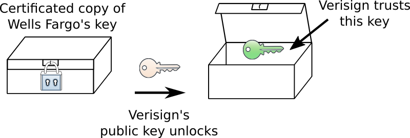
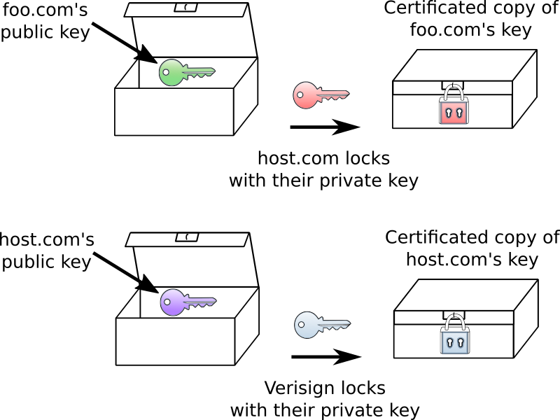

.. include:: ../../global.rst

.. index:: certification authorities, signing, digital

Certificate Authorities in Use
=========================================

Now, when your computer connects to wellsfargo.com, the webserver can give your computer a copy of the locked-up public key. (Since this is all really happening electronically, we can make an infinite number of copies of the "locked box".) Your computer already has and trusts the public key for Verisign - it can use that key to unlock the box and reveal the wellsfargo.com public key. There is nothing secret about the public key that is locked up - anyone else could open that box as well. Instead, what is important is that you know that the public key inside the box **must** have been locked up by Verisign. No one else could have locked the box as only Verisign has the private key that corresponds to the Verisign public key.

Since we trust Verisign's public key, we can trust that Verisign must have produced the locked box (the encrypted key); we also trust that Verisign validated that the public key belongs to Wells Fargo before they locked it up; therefore, we can trust that the encrypted key must really belong to Wells Fargo. This process of encrypting something in a way that does not keep it secret, but instead proves that it came from a particular source is known as **digital signing**.

   |br|

   Anyone can unlock the certificate package, but only Verisign could have put the key into it.

This chain of trust can be extended with to build a whole chain of trust. Say I run a small web business (call it "foo.com") and want to create a secure server. I am too small for Verisign to deal with - they only want to work with large companies. So instead, I could go to my web provider (lets call them "host.com"). I get them to verify me and **sign** my public key (encrypt it using their private key). They are big enough to get a copy of their public key signed by Verisign. Now, if you connect to foo.com you are given the copy of my public key that was encrypted by host.com. To unlock that package, your browser asks host.com for the copy of their public key that was encrypted by Verisign. That can be unlocked with the Verisign key built into your browser. Once the host.com public key has been unlocked, it can be used to unlock the foo.com key. Because you trust Verisign and Verisign trusts host.com and host.com trusts foo.com, you can trust foo.com.

   |br|

   To verify foo.com's key I first use Verisign's public key to unlock host.com's public key. Then I can use that public key to unlock foo.com's public key.
