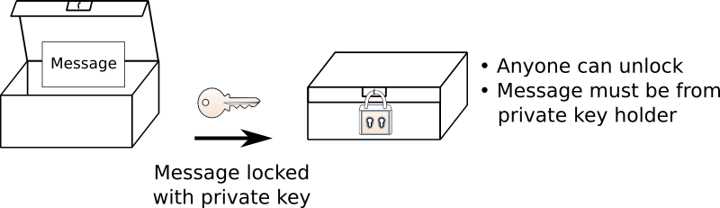
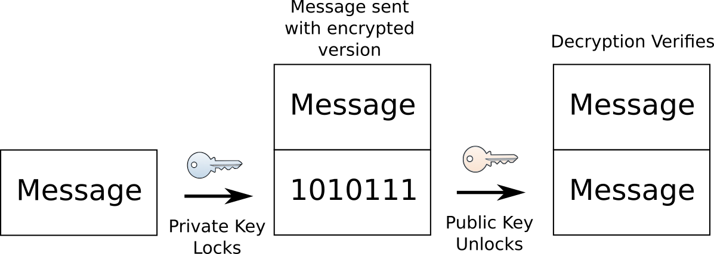
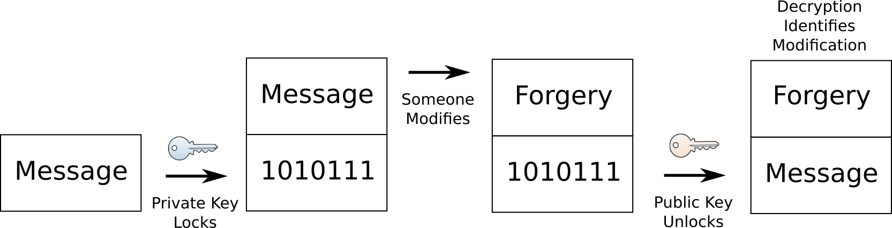
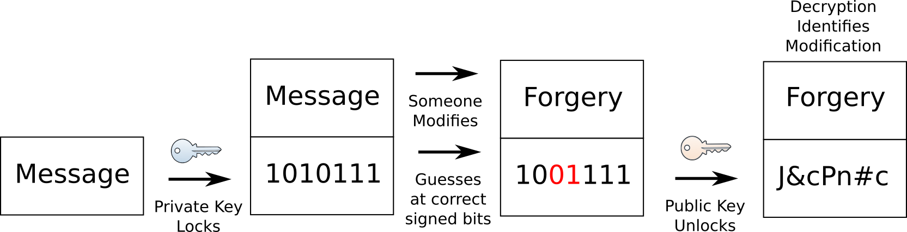

.. include:: ../../global.rst

.. index:: public key cryptography

Public Key Cryptography
=========================================

We have established the idea of a special lock that has a pair of keys; in a few pages we will look at how that conceptual idea can be turned into a mathematical recipe (feel free to :ref:`skip ahead <asymmetric_math>` if you want to be convinced that can be done). But it is not clear how that solves the problem of your computer authenticating a website like wellsfargo.com when you connect to it - we need a way to verify the identity of that site.

The trick used on the internet to solve this problem sounds unintuitive - we generate pairs of encryption keys and then give one of them away. Websites that want users to be able to verify their identity and connect securely generate an asymmetric key pair (we will call the two keys A and B) then keep one of the key pair secret (either A or B, it does not matter) and give the other key to whoever wants it. The key that is handed out to anyone is called the **public key** and the one that is kept secret is the **private key**.

Because the private key is a secret only held by the website and anyone can have a copy of the public key, they give very different guarantees. We can use them for **secrecy**, or for **authentication**.

Secrecy
---------

A message someone locks with that **public key** can only be read by the holder of the **private key**. (Remember the same key cannot be used to unlock a box it locked.) Thus, anyone can use someone else's **public key** to encrypt a message and be sure that only the holder of the **private key** can decrypt it.

.. figure:: Images/guarantee2.png

Using public/private keys in this way is the method that is most similar to using a shared key. The goal is to send a secret message only one person can read.  

Authentication
----------------

When a message is locked by someone with their **private key**, anyone can use the person's **public key** to unlock it. When they read the message, the person who uses the **public key** can be certain that the message came from the holder of the **private key** and was not tampered with along the way. They know this because the only way to make a lockbox that **public key** opens is with the matching **private key**. 

This message is said to be **signed** - we can tell it came from a certain source.

This **signing** of messages is a very different way to use encryption. There is nothing secret about the message. In fact, the original message will be sent with the **signed** (encrypted) copy. The recipient decrypts the **signed** message to verify that the original is in fact authentic:

If someone tries to modify the message, between the sender and the end recipient, decrypting the **signed** copy will reveal that someone modified it and we should not trust the message. 

The forger could try to modify the encrypted bits, but without the correct **private key**, they will not be able to make a **signed** copy of the forged message. Instead they will be forced to
guess at the correct bits that would decrypt into the message they tried to forge. Unless they get improbably lucky, their "signed" message will likely look like nonsense when decrypted:

------------------

Now to make sure that we are talking to the real wellsfargo.com, we just need to have a copy of their public key and ask them to send us messages encrypted using their private key. If we can read the messages with the public key, they must have come from Wells Fargo. But how can we be sure that we get a copy of their public key? If we connect to wellsfargo.com and ask for a copy, someone who intercepted our message could simply give us their public key and claim it was Wells Fargo's! We need a way to get that key from a trusted source.
