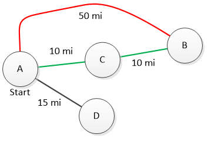

.. include:: ../global.rst

.. index:: best first search

Weighted Breadth First Search
=========================================

The Breadth First Search algorithm considers each "step" as counting the same - each is one move. This approach makes sense for constructing a word ladder but breaks down if we try to plan the shortest route to travel between two towns. In this situation, not every **edge** (a link between towns) is the same length. There are longer roads and shorter roads. If we don't pay attention to how long edges are, we could end up finding a "one step" route from one location to another, even though there is a "two-step" path that can be done in fewer miles.

    .. 

    A breadth-first search would start from A and "discover" that we can go straight to B, C, and D. It would not find the more optimal path to B that requires two steps.

This situation - where the edges can be assigned different costs - is known as a graph with **weighted edges**. To find an optimal path in this situation, we need to modify the search algorithm to account for the cost of each edge. In this version, we will explore out from a starting point and at each step, chose the cheapest location to reach that we have not yet explored. To determine the cost to reach a location, we will calculate the sum of all the edges needed to reach a location. This video demonstrates the process:

.. youtube:: w8oM3cSEQsk
    :height: 315
    :width: 560

Try out the process yourself using the link to the Search Playground below. It will check that you are always choosing nodes to explore in the correct order. To keep track of what your options are, use some scratch paper to draw a search tree as you explore. (For now, don't use the "Allow Intuition" option.) Click the "New Random" button to make new maps.

`Search Playground <../_static/searchApp/search.html>`__

.. note:: The algorithm we are discussion is essentially a simplified version of `Djiksta's shortest path algorithm <https://en.wikipedia.org/wiki/Dijkstra%27s_algorithm>`__. It finds the best route from one vertex to every other vertex in a graph.
