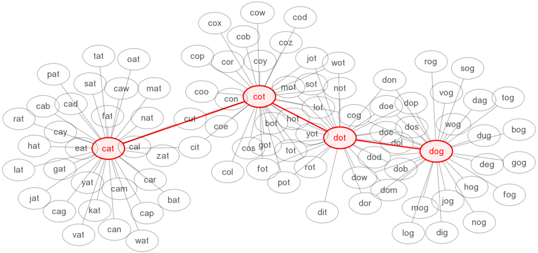

.. include:: ../global.rst

Search and Other Problems
=========================================

The algorithm discussed on the previous page is a much more general tool than it might appear at first. This same basic technique can be applied any time we can represent a problem as a collection of possible states (locations) and transitions (steps) between those states.

For example, take the kind of puzzle called a **word ladder**. A word ladder involves trying to turn one word, say *cat* into another, say *dog*, by changing just one letter at a time to make a new word. From the starting word *cat* we could make lots of words: *cab, car, can, cap, bat, rat, fat, mat, cot, etc...* Each of those words leads to other possible words.

Viewed as a search problem, each word is a "location", and the "steps" between each location show the moves we can make. Now, finding a word ladder to turn *cat* into *dog* involves the same process as finding a path from one location to another. First consider all the possible words that you can make by changing one letter of "cat". Then take each of those new words and consider each word that you can make by changing its letters... The image below shows a visualization of a word ladder that might result from such a search:

    ..

    A word ladder: cat -> cot -> dot -> dog.

Once again, we know that this algorithm would find the shortest possible ladder as we check every possible "one step" solution before we move on to two-step solutions, and all the possible two-step solutions before moving on to three-step ones.

