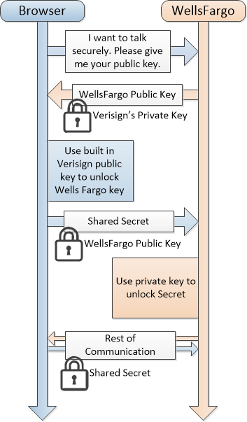
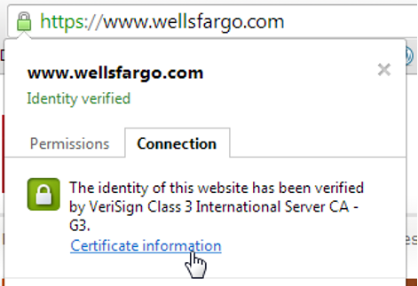
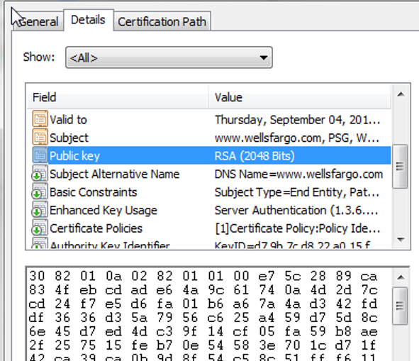
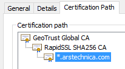

.. include:: ../../global.rst

.. index:: certification authorities, certificates

HTTPS
=========================================

Now we have a system in place for how we can establish trust when connecting to new servers on the internet. The only remaining issue is that asymmetric cryptography algorithms tend to be slower than symmetric ones - they require significantly more processing power to run. So instead of using asymmetric cryptography for all secure web traffic, we only use it to start communication. Our computers use the signed public keys of servers to verify their identity. Once we are sure we have the right public key, we can use that to encrypt a message that only the server we want to talk to can read (using their private key). So we can create a traditional symmetric key and send that securely to the server to establish a shared secret key. This shared secret key will only be used temporarily for the duration of our communications with that server.

This is the basis of secure communication on the web - what is known as **HTTPS**. (Unsecure web pages are served to your browser using the HTTP communications system *HyperText Transfer Protocol*, the **S** at the end of HTTPS indicates *Secure*). When your browser has made a secure connection you will typically see an icon indicating that fact:

You can inspect the certificate itself:

  |br|

  The certificate that identifies wellsfargo.com's public key. Here we can see the hexdecimal version of their 2048 bit long RSA public key.

As well as the chain of trust that was used to verify the certificate:

   |br|

   The chain of trust that lets my browser authenticate arstechnica.com's public key: arstechnica.com's key was signed (locked) by RapidSSL. RapidSSL's key was signed by GeoTrust. GeoTrust's key is built into my browser.

.. note::

  Web servers can not use the same trick to identify whether or not the computer they are talking to really belongs to **you** - there are too many people to have a central authority verify them all and sign their public keys. This is why you have to log into servers with a username and password or some other form of identification. (Though high security systems will sometimes use public/private key pairs to authenticate users - typically you directly provide a public key to the server that it can later use to verify that you posses the correct private key and thus verify your identity.)
