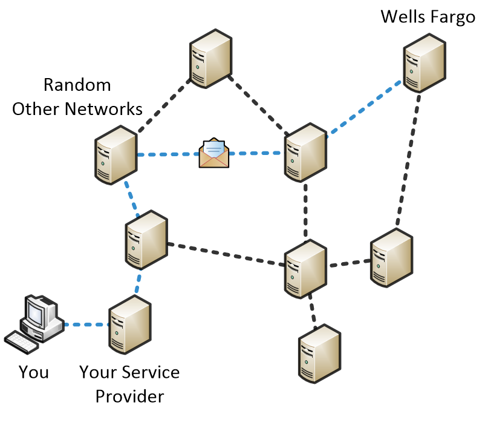
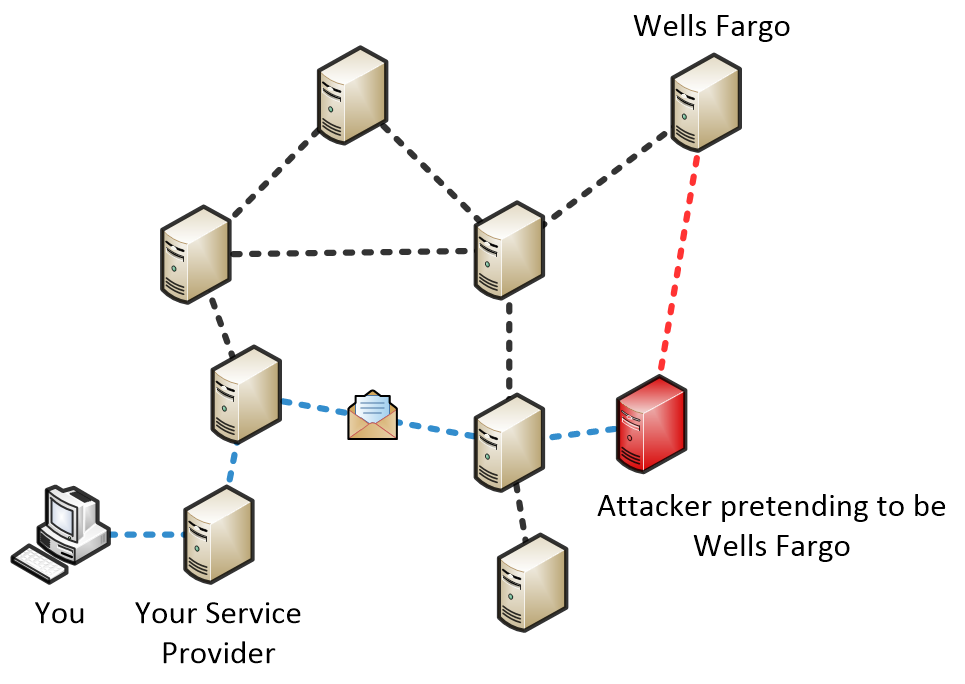

.. include:: ../../global.rst

.. index:: internet architecture

Internet Architecture
=========================================

Say you have a computer that is connected to the internet and you want to access your bank account at wellsfargo.com in your web browser. To make this happen, the message "please send me the login page" needs to get from your computer to the web server at Wells Fargo. This would be easy if your computer was directly wired to the Wells Fargo webserver, but that is not how the internet works - the internet is a loosely connected network in which any message often has to pass through multiple computers to get to its destination.

   |br|

   A message will travel through many networks on the way to its destination. The exact path is determined by the network.

So, like a piece of physical mail, an electronic message must be marked with extra information about where it is going and where it is coming from. Internet messages are bundled into **packets** consisting of both a message and information about its destination and source. When your browser wants to request a particular web page, the request is bundled into one of these packets. Then, this packet is sent from your computer to another computer (or a specialized computational device known as a router) that is owned by whoever is providing the internet service: your phone company, the college, or the Starbucks you are sitting in. That packet is then passed through more computers owned by the network of the service provider until it reaches an exit point where messages are forwarded to other networks. At that exit point, there are records that indicate the best way to route messages - who to pass a packet to based on where it is going.

This routing information is neither fixed nor permanent. As new networks join the internet, they advertise to their neighbors what addresses they can route packets to and how quickly they can do so. As they learn what locations their neighbors can send information to, they add those locations to their own records. For example: I connect a new server to the backbone of the internet and it is directly connected to servers at AT&T and Verizon. AT&T's server tells mine that it can get packets to wellsfargo.com 4 steps; Verizon's server tells mine that it can get the message there in 6 steps. From that information, my server can conclude that any messages that it gets that are bound for wellsfargo.com should be sent through the AT&T server and that the message will take 5 steps to reach its destination (1 step to get it from my server to AT&T and 4 more steps from there). If something happens to my server's connection to AT&T - it sends a packet to the server and never gets confirmation it was received - it will stop routing traffic that way and chose a new route for those messages.

In the real world a message often passes through at least a dozen hops on its way to its destination. If you are the one sending the message and you do not want anyone other than the final recipient to read it, you need to encrypt your message. We have learned how two people can come up with a shared secret to start encrypting their communication using the Diffie-Hellman algorithm, but that does not help us here.

.. sidebar:: Internet Hijacking

  Hijacking of traffic is not a purely hypothetical event. In 2013 there was a sustained series of events where some entity `hijacked internet traffic <http://arstechnica.com/security/2013/11/repeated-attacks-hijack-huge-chunks-of-internet-traffic-researchers-warn/>`_ and routed it through Belarus and Iceland before forwarding it to its destination .

Why? We have no control over where the message goes. The computer that sends the original message does not pick a route for that message - it simply hands it off to another computer that promises to direct the message to its destination. The message will pass through many computers along the way. Any of these network along the way could pretend to be the final destination and send back a reply - pretending to be wellsfargo.com and asking you to provide your username and password. Even worse, a malicious network can try to advertise that it provides quick routing to wellsfargo.com to encourage traffic to be routed through them.

   |br|

   A server could intercept traffic it is supposed to send on. Your computer can not tell if the reply it gets is from the real Wells Fargo or an imposter.

If you send a message to wellsfargo.com to start the Diffie-Hellman process of picking a shared secret to use the for encryption, an imposter could just pretend to be Wells Fargo, work with you to generate an encryption key, and then use that to communicate with you. You would be talking in secret, but to the wrong machine!
