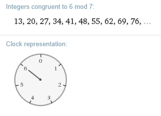

.. include:: ../global.rst

.. index:: Diffie-Hellman, mod, modulo, clock arithmetic

Diffie Hellman (Ch 4) 
=========================================

`Kahn Academy has a nice series of videos <https://www.khanacademy.org/computing/computer-science/cryptography/modern-crypt/v/the-fundamental-theorem-of-arithmetic-1>`__ on cryptography, clock arithmetic and the Diffie-Hellman. If you are feeling at all shaky on these topics, I highly recommend watching the first 4 videos in the series that link takes you to. Even if you think you have it all down, the videos add a little detail that you might find interesting.

.. pseudo_h3:: Math Tips
    :class: underlined
    
Doing clock math on small numbers isn't too hard - once you learn about it, you should be able to figure out what say 20 on a clock size of 7 is (answer is 6). It is a little bit harder when you are dealing with really large numbers. Here is a tip on how to calculate clock math for large values:

The more formal name for clock math is modulo arithmetic or mod for short. We would write 20 on a clock size of 7 as: :math:`20 \textrm{ mod } 7`. You can ask `wolfram alpha (www.wolframalpha.com) <www.wolframalpha.com>`__ to do that math for you, try typing "20 mod 7" in the box below:
    
.. raw:: html

    

    

    
    
The results will include the answer as well as other handy info like other numbers that produce the same answer for the given clock and the clock representation of the answer.
    
Wolfram Alpha will work even when arbitrarily large numbers are involve. With Diffie-Hellman, the use of exponents means the values involved grow rapidly, but Wolfram Alpha will do just fine calculating something like 23 to the 17th power on a clock size 11. Use ^ to represent exponentiation and type something like "23^17 mod 11" as your input.    

.. pseudo_h3:: Practice Problem
    :class: underlined
    
Want to verify you know how to do the calculations from this week's 9 Algorithms chapter correctly? Try this:

We want to communicate secretly. I announce publicly that our clock size will be 13 and our base will be 4. I then pick my private number and use it to calculate my Public/Private number and announce it is 10.

You pick the private number 8 (sorry, need to make sure everyone "picks" the same one). You calculate your Public/Private number as 3 and announce that. (Verify this calculation).

Use the publicly available information and your private number to calculate our Shared Secret Number (SSN). Once you think you have it, go to: 

**\http://faculty.chemeketa.edu/ascholer/SSN.html** 

Where *SSN* is the number you calculated (something like **...ascholer/1.html** or **.../ascholer2.html**). If you get a error page you know you got the wrong number!

Incidentally, because our clock size is 13, it would be easy to uncover the secret. You simply have to try **0.html**, then **1.html**, **2.html**, ... up to **12.html** - on a clock size of 13 you can never have an answer greater than 12. For this reason, when using hte algorithm in real life, the clock size needs to be much, much larger.
