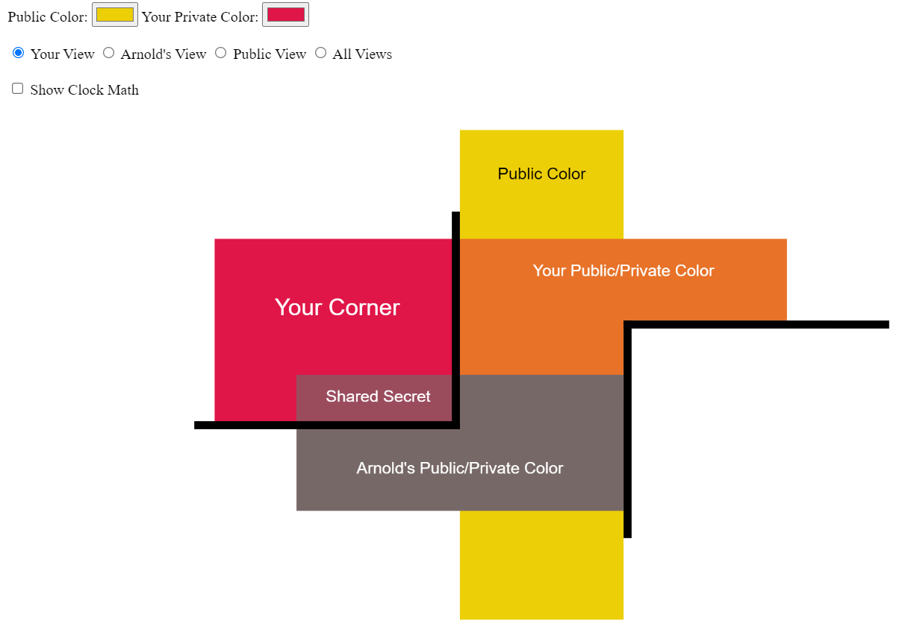

.. include:: ../global.rst

Diffie Hellman Color Mixing Playground (Ch 4)
=======================================================

The `Diffie Hellman Color Mixing Playground <../_static/sharedSecretColorApp/colorMixing.html>`__ is a JavaScript app that allows you to experiment with the shared secret paint-mixing example from chapter 4.

.. pseudo_h3:: How To Use
    :class: underlined

Initially, you will see a series of interconnected colored boxes, each representing a different mixed color. Behind the black "walls" are your color and Arnold's color, which can only be seen from their corresponding views. In the middle is the public color, which is always visible. The boxes overlapping the public color, are your and Arnold's public/private colors (the private color mixed with the public color). Notice how those boxes extend past the wall and into each corner. The overlap between the private color, and the other person's public/private color, shows the shared secret color.

Additionally, You can enable the use of "clock math", which will show you the calculations used to derive a shared secret number.

* Use the color selectors in the top left corner to change the public and private colors.
* Click the radio buttons to change views.
* Click the "Show Clock Math" checkbox to enable calculations
* With clock math enabled, use the lower text boxes to change your private number, the public base, and public clock.

.. attribution::
    :title_1: Diffie Helman Color Mixing Demo Application
    :author_1: Samuel S. Jennings