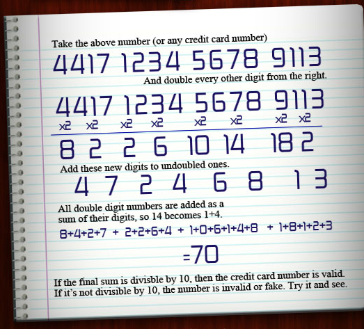

.. include:: ../global.rst

.. index:: hamming code

Error Detection & Correction (Ch 5) 
=========================================

.. pseudo_h3:: Optional: Validation 
    :class: underlined

Error detection codes are built into many of the numbering systems we use in daily life to prevent simple mistakes. Things like credit card numbers and book ISBNs are designed so that if someone mistypes a digit the error is easily detected.
    
.. pseudo_h4:: Credit Cards

The basic process for checking a credit card looks like this:

    `Image copyright mint.com <https://www.mint.com/blog/trends/credit-card-code-01202011/>`__
 
You can try it out by hand with your own card or on this spreadsheet:

`Credit Card Validation Spreadsheet <https://docs.google.com/spreadsheets/d/1TXNIsCdceepd48eZWhQZTEYeb9WEsdFZSSvPQNFqtnw/edit?usp=sharing>`__.    
    
Book ISBN numbers are validated with a stair-step code. You will build a program to do this later on in the course, but if you are interested you can `read about how the validation works here <http://en.wikipedia.org/wiki/International_Standard_Book_Number#ISBN-10_check_digits>`__.
    