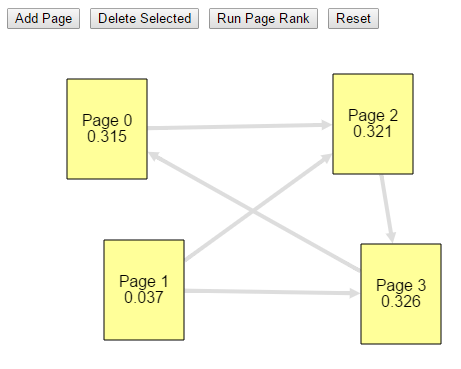
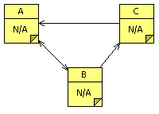

.. include:: ../global.rst

.. index:: page rank

Page Rank (Ch 3) 
=========================================

.. pseudo_h3:: Hints for Simulator
    :class: underlined
    
The `PageRank Simulator <http://faculty.chemeketa.edu/ascholer/cs160/WebApps/PageRank/>`__ is a javascript applet that should run in any modern browser.

You can use it to run simulations of how PageRank would assign importance to a group of web pages based soley on how they link to each other.

* Click Add Page to add a new page.
* Click and drag a page to move it.
* Click a page and then click another page to add a link.
* Click a page or link and then Delete Selected (or press Delete) to remove something.
* Click Run Page Rank to display rankings.
	
    

.. pseudo_h3:: Optional: Mathematically Solving Page Rank
    :class: underlined
    
The author describes being able to simulate a random web surfer with a computer program, and we certainly can calculate page rank that way. But there is a field of mathematics that focuses on analyzing situations exactly like that one - where there are multiple possible states (pages in this case), and from any given state, we can end up in multiple new states with some probability. The technique used is called a `Markov chain <http://en.wikipedia.org/wiki/Markov_chain>`__. If you have some knowledge of what a matrix is you can skip down to the Example section of that page, and probably understand most of what is going on.

This is the actual technique used in PageRank to "simulate" random surfers - define transition probabilities from one page to another based on the links (and on random restart probability), then keep multiplying a starting state by the transition matrix until it "settles" down into a final state representing the proportion of time a random surfer spends on each page.

If you are interested, you can play with a Markov simulation using the spreadsheet linked below (right click and open in a new tab/window).

`Markov Chain Page Rank Spreadsheet <https://docs.google.com/spreadsheets/d/1wdot_YSEDWqjUnZ2xgap_IE4qR7nKlxOfAZyNunGvU4/edit?usp=sharing>`__. 

It represents a 3 page system as a 3x3 matrix. The 3x3 grid allows you to define the links between pages. The initial setup matches the picture shown to the right (A links to B, B links to A and C, C links to A).

The columns below show the predicted popularity after n steps of applying the transition rules. The first row is the initial rankings of the pages. An important property of the Markov chain is that they do not matter! Put in any set of rankings for the initial state that add up to 1 and the transition matrix will eventually produce the same result.