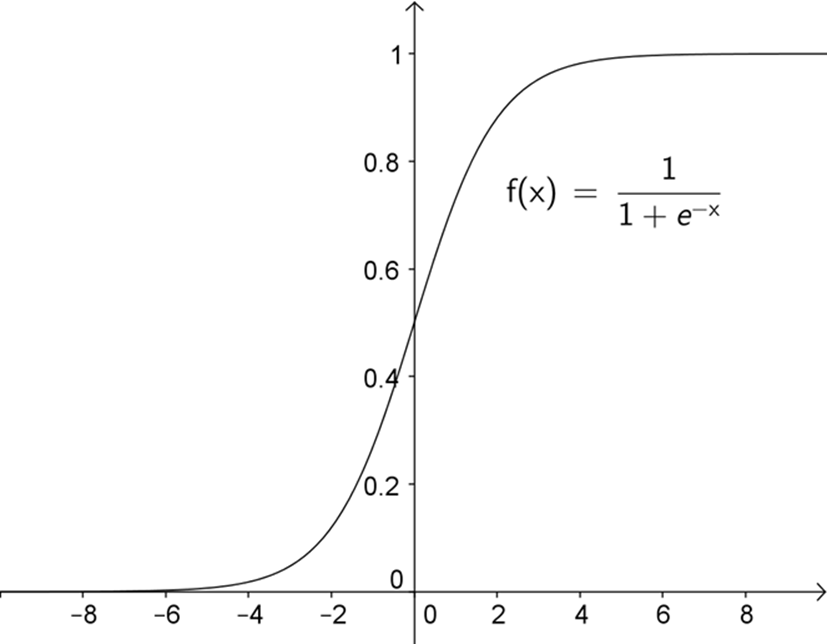

.. include:: ../global.rst

.. index:: machine learning, decision trees, neural networks

Pattern Recognition & Machine Learning
=========================================

Decision Trees, Neural Networks and Nearest Neighbor algorithms are all similar in that they are algorithms for recognizing patterns - for looking at incomplete information and making judgments based on it. But Decision Trees and Neural Networks share another characteristic: they are both forms of **machine learning**. In a machine learning algorithm, it is not up to a human to specify every detail of how to solve a problem. Instead, a programmer sets up a system that allows the computer to "learn" how to categorize data by looking at examples. These training examples are inputs for which the desired output is known. The computer works backwards from these samples to adjust parameters in the algorithm it is running so that it produces the desired output.

This kind of approach makes lots of sense when we are dealing with problems for which human experts "know" the right answer but can't cleanly describe a set of rules to get to that answer; things like "does this picture have someone with sunglasses in it?" Instead of people having to explicitly describe how to solve the problem, the machine learning algorithm can presented with a series of examples (pictures for which a person has already decided *yes* or *no* sunglasses) and figure out through trial and error what works.

.. pseudo_h3:: Decision Tree Applet
    :class: underlined
    
You can download the decision tree builder to experiment with decision trees from the course web page. The video below demonstrates how to use it. The human input to the process is the training data and the details that the system considers for each example. (In the email example in the video, someone had to decide that email length would b a criteria and the possible values were *short* or *long*). The computer's contribution is to figure out how to arrange those details into a decision tree to best categorize examples.

.. youtube:: 5lM9Mq5wzJo

`Closed Caption Version <https://smartplayer.captionsync.com/play.php?vid=1521237964sagefreeman_3741054e6efb>`__

|br|

.. pseudo_h3:: Neural Networks
    :class: underlined
    
This video demonstrates using the Neural Network Applet. The human contribution to a neural network is deciding on how many nodes there will be and training samples that match input values to a desired output. The computer algorithm repeatedly tweaks the connection weights between nodes until it finds a set of weights that produce the desired output.

Although you do not have to use the Neural Network program yourself, do watch this video to check out what happens when a neural network is trained. (Note: Video stops at 4:21 mark. The rest of the video shows an applet that uses a neural network to recognize symbols, you can watch that part if you want but do not need to.)

.. youtube:: h4mSmqHmLRA?end=261

`Closed Caption Version <https://smartplayer.captionsync.com/play.php?vid=1521237983sagefreeman_f72e437146eb>`__

|br|

.. pseudo_h4:: Optional: Sigmoid Functions

Nine Algorithms talks about how in a neural network we may have nodes that output a value between 1 and 0. If the inputs far exceed the threshold the output is 1, if they are well short of the threshold the output is 0, but if it is close, the output may take on an intermediate value. A little more detail may help this process make sense.

Usually, a **sigmoid** or "S" shaped function is used to calculate the output of a neuron based on its inputs. One possible function is shown below. The input to the function (x) would be the sum of weighted inputs minus the threshold. So if inputs to a neuron totaled 1.9 and the threshold was -4, the x value would be -2.1. That means the output of the neuron would be about 0.1.

    ..
    
    x-axis represents amount the sum of inputs exceeds threshold by. y-axis is output value.
