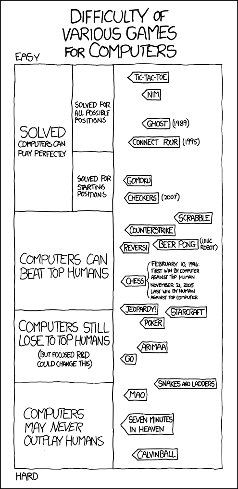
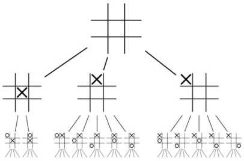

.. include:: ../global.rst

.. index:: artificial intelligence, chess

Search & AI, page 3 (Bonus Topic)
=========================================

.. pseudo_h3:: Game Play
    :class: underlined
    

    `Cartoon by XKCD <http://xkcd.com/1002/>`__

Our basic search algorithm can also be modified to play games. A computer can examine every possible move, then each possible response, to look for the optimal move in any situation. This produces an upside down tree like structure like we saw with the eight puzzle. Here is what it might look like for Tic-Tac-Toe:

    
|br|

For simple games like tic-tac-toe, a computer can easily simulate every possible game. In any situation it can figure out the move most likely to lead to success by assuming on the opponent will always make the best possible move they have available. (\ *"if I take the corner, he will take the center..."*). 

For more complex games, computers can't simulate an entire game, but can simulate enough of the possible moves to reliably win. For these games, some kind of heuristic search is usually used to focus the computer's attention on the most promising moves.
    
While expert human chess players can mentally play a sequence of moves to explore a possible action, they can only consider a couple of moves per second. Instead of explicitly analyzing each possible move and counter move, people rely on experience to identify patterns and positions that are likely to be promising, focusing their attention on those. A computer can use heuristic search to emulate this process, but in general, a computer isn't as good at recognizing patterns - their heuristics just are not as good as top level players. On the other hand, a computer can consider many millions of moves a second.

IBM has long used self designed "Grand Challenges" to push their engineering knowhow by attacking difficult unsolved problems. The Deep Blue computer was a project at IBM in the 1990s that became the first machine to beat the human world champion: 

.. youtube:: KFSVZlkHHmM

More recently, IBM built a computer that beat some of the best human players at Jeopardy - a much more daunting problem for a computer. You can find `more info about that project here <https://www.youtube.com/results?search_query=ibm+watson>`__ if you wish.

    

