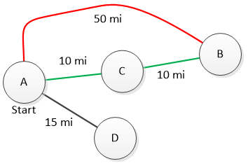

.. include:: ../../global.rst

.. index:: best first search

Best First Search
=========================================

The Best First Algorithm considers each "step" as counting the same - each is one move. This approach  makes sense for constructing a word ladder, but breaks down if we try to plan a shortest route to travel between two towns. In this situation, not every **edge** (link between towns) is the same length. There are longer roads and shorter roads. If we don't pay attention to how long edges are, we could end up finding a "one step" route from one location to another, even though there is a "two step" path that can be done in fewer miles.

    .. 

    A breadth first search would start from A and "discover" that we can go straight to B, C, and D. It would not find the more optimal path to B that requires two steps.

This situation - where the edges can be assigned different costs - is known as a graph with **weighted edges**. To find an optimal path in this situation, we need a new search algorithm: **Best First Search**. In best first search, we consider not the number of steps, on a path, but the total miles (or km, or minutes of travel, etc...) that it takes. This video demonstrates using a Best First Search to make sure we find the best possible path from one town to another.

.. youtube:: uyfZlHtXP74

.. note:: This is a simplified version of an algorithm called Djiksta's shortest path algorithm. It finds the best route to every other city from a given city. You can `try it out here <http://www.cs.usfca.edu/~galles/visualization/Dijkstra.html>`__ if you like. Enter a vertex (circle/town) number to start at and press the Run Djikstra.
