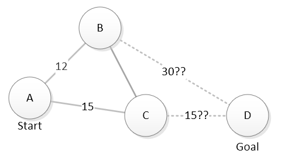
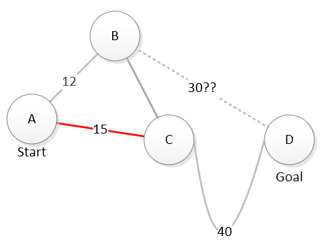

.. include:: ../../global.rst

.. index:: heuristic

Heuristic Search Continued
=========================================

Of course, computers do not have intuition. For a computer, a **heuristic** has to be a function that makes some prediction about how promising a potential move looks. On a map that might be *"calculate the straight line distance from a location to our goal"*. This diagram shows this heuristic being used to estimate the relative potential of exploring through B or C to reach D. The dashed lines show the straight line distance from B and C to D - our estimate of how much more work will remain if we chose each location.

 
Looking at that map, it seems like C is a better bet than B. By traveling through C, it looks like we potentially could reach D in 15 + 15 = 30 units of travel. B may be closer to where we are now, but our estimate is that a path through B will take 12 + 30 = 42 units of travel. We are ranking our choices based on the the combined known cost to reach the location and the estimation of how much more work will remain.

:math:`\textrm{total cost} = \textrm{known cost to reach X } + \textrm{ estimated cost from X to goal}`

Of course, estimates can be wrong. That is why we have to include the known cost. Say we decide to explore location C and in doing so, learn there is no easy direct path from C to D:

 
Now, our known cost to reach D through C is 15 + 40 = 55 and there is no more estimated extra cost. Considering a path through B, we still have a known cost of 12 and an estimated further cost of 30 for a total estimation of 42. We should probably go explore B before deciding that A --> C --> D is the best route.

By carefully picking our heuristic, including both the known cost and the estimated future cost in our decision making, and updating our estimates every time we make a move, we can guarantee that the best answer is found. And while we search, we will avoid doing work to explore possibilities that are clearly worse - thus it should take less work to find our answer.

.. note:: This algorithm is a simplified version of the `A * (A-star) algorithm <https://en.wikipedia.org/wiki/A*_search_algorithm>`__.
