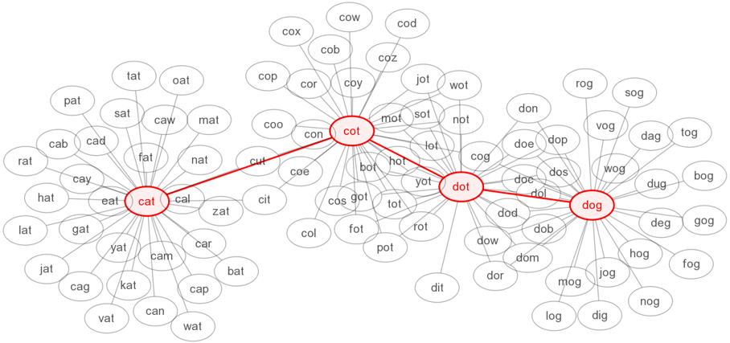

.. include:: ../global.rst

.. index:: best first search, shortest path

Search & AI
=========================================

.. pseudo_h3:: Best First Search
    :class: underlined
    
How does google maps plan a route? Imagine we have a map that shows different towns and the distance between them. This video demonstrates a technique to make sure we find the best possible path from one town to another.

.. youtube:: uyfZlHtXP74

.. note:: This is a simplified version of an algorithm called Djiksta's shortest path algorithm. It finds the best route to every other city from a given city. You can `try it out here <http://www.cs.usfca.edu/~galles/visualization/Dijkstra.html>`__ if you like. Enter a vertex (circle/town) number to start at and press the Run Djikstra.

This same basic technique can be applied any time we can represent a problem as a collection of states and transitions between those states. For example, take the kind of puzzle called a **word ladder**. A word ladder involves trying to turn one word, say *cat* into another, say *dog*, by changing just one letter at a time to make a new word. From the starting word *cat* we could make lots of words: *cab, car, can, cap, bat, rat, fat, mat, cot, etc...* Each of those words leads to other possible words. 

Viewed as a search problem, each word is a "location", and the "roads" between each location show the moves we can make. We would assign each step a cost of 1 and try to find a path with the minimal number of moves using the same process as we did on a map. One solution for cat->dog is shown below.
    

    
    ..
    
    A word ladder: cat -> cot -> dot -> dog.

A computer using this algorithm would first determine all the words that were 1 step away from the start word. Then it would take each of those words, and find the words that were 2 steps away. Then it would look at each 2 step word to figure out where it could get in three steps... spreading out something like the animation shown below.

.. raw:: html

    
    

    <canvas id="Processing_BFS" style="border-style: solid; image-rendering: -webkit-optimize-contrast !important;" tabindex="0" width="580" height="400"></canvas>

    
    

 
    

    
Animation based on work by <a href="http://joseph-harrington.com/2012/02/breadth-first-search-visual/">Joseph Harrington</a>

    <button id="dobfs" type="button">Restart</button>
    

     

    
