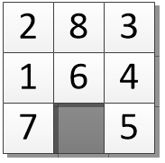
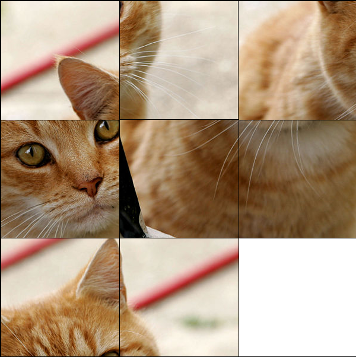

.. include:: ../global.rst

.. index:: artificial intelligence, heuristic, eight puzzle*

Search & AI, page 2 (Bonus Topic)
=========================================

.. pseudo_h3:: Heuristic Search
    :class: underlined
    
One problem with the search shown on the previous page is all the wasted effort. Think about all the red lines (paths that had to be explored) required to find the right path in the final animation. If each possible search location has many possible moves, the space we are searching grows too rapidly to make progress past a couple of steps. Consider a situation in which each move leads to 20 new moves. In one step we have 20 location to worry about. After 2 steps, we have 20 x 20 = 400 locations we need to consider. By seven moves we have over a billion possibilities!

===================  ==============  ==============  ==============  ==============  ==============  ==============
Step #               1               2               3               4               5               6
===================  ==============  ==============  ==============  ==============  ==============  ==============
# of Locations       20              400             8,000           160,000         3,200,000       64,000,000  
===================  ==============  ==============  ==============  ==============  ==============  ============== 

What we need is a way to constrain the search - to explore the "good" possibilities before we worry about the crazy looking ones. Imagine you were doing the *cat → dog* word ladder. You would probably say something like "hmmm, I could make *cot* and that looks like it is closer to *dog*". You then would look at where *cot* could take you before backtracking and trying something like cat → bat. If at some point you got stuck, you would go back and think about something else.

Adding this extra bit of *"I think this direction looks promising'* gives us a **heuristic search** algorithm. A **heuristic** is simply a rule of thumb - a shortcut that helps guide us in the right direction. For the word ladder, our mental heuristic would be something like *"first try words that have more letters that match the target"*. Because *cot* is only 2 letters off from *dog* we would explore it before we worried about *bat* which is 3 letters off from *dog*.

.. pseudo_h3:: Eight Puzzle
    :class: underlined

    

    

    ..
    
    `Click here for an 8 puzzle you can try by hand <http://kiznore.pythonanywhere.com/puzzle/>`__

To get a better sense of how heuristics work we are going to solve the *eight puzzle*. In this puzzle you have 8 squares in a 3x3 grid with one open square. You make moves by sliding a piece that is next to the empty square into the gap. The goal is to rearrange the 8 pieces into a particular picture or pattern.

To guide our search we need to come up with a heuristic - something that does a pretty good job of estimating the amount of work that remains. Since each move can only move one piece, if there are 4 pieces out of position, we know there are at least 4 more moves to go. That suggests we can at any point look at a board and estimate the remaining work by counting up the number of pieces that are not in the right place according to the goal. If we add that estimate of future work to the amount of work it take to get to any state, we can estimate how much work the total path to the goal will be if we go through that state. 

:math:`\textrm{estimated cost} = \textrm{moves so far } + \textrm{ pieces out of place}`

When we pick a state to explore next we will always chose the one with the smallest estimated total cost.

.. raw:: html 

    
     
    
    
.. tabbed:: eightPuzzle

    .. tab:: Start
    
        .. image:: Images/8puzzle1.png
            :width: 100%
            :class: puzzleborder
        
        The starting and goal states for our 8-puzzle.

    .. tab:: 1
    
        .. image:: Images/8puzzle2.png
            :width: 100%
            :class: puzzleborder
        
        Here are the 3 possible first moves from the starting position. Each new state is assigned a cost based on A) how many moves it took to get there and B) how many pieces are still out of place in comparison to the goal. 
        
        The middle square has the lowest estimated cost, so we will explore it next.

    .. tab:: 2
    
        .. image:: Images/8puzzle3.png
            :width: 100%
            :class: puzzleborder
        
        Each of these states took two moves to reach (from the starting state) - that number is reflected in their cost. 
        
        Note that we could have slid the 6 back up to the middle, but that would get us back to the same board as the starting state but having used two moves. There is no reason we would want to do that... so we are omitting that move. In general, if a move would produce a board we have already seen how to make with fewer moves we will ignore it.
        
        Two of the new states have a cost of 5. We have three other states with a projected cost of 6, but there is no reason to worry about them until we have explored the cost 5 ones. Since we don't have any other tiebreaker, we will randomly select the leftmost one to explore. 

    .. tab:: 3
    
        .. image:: Images/8puzzle4.png
            :width: 100%
            :class: puzzleborder
        
        Now we are three steps from the start - both of the new states have a cost of 3 + *pieces out of position*. (Theoretically, there are three moves we could have made, but moving the 1 back to the left side gets us right back to a board we have already seen, so once again we are ignoring it.)
        
        Exploring that square did not produce anything more promising looking that the state with an estimated cost of 5. We will ignore all of the 6's and 7's for now and go back to look at the other 5.
        
    .. tab:: 4
    
        .. image:: Images/8puzzle5.png
            :width: 100%
            :class: puzzleborder
        
        
        Two new states. These are both 3 moves from the starting state. 
        
        The new one with a cost of 5 is the best looking option we have, we will explore it next.
        
    .. tab:: 5
    
        .. image:: Images/8puzzle6.png
            :width: 100%
            :class: puzzleborder
        
        Two new states. These are both 3 moves from the starting state. 
        
        The new one with a cost of 5 is the best looking option we have, we will explore it.
        
    .. tab:: End
    
        .. image:: Images/8puzzle7.png
            :width: 100%
            :class: puzzleborder
        
        There are two new moves we can make. One of them doesn't look very good, but the other is exactly what we are looking for.
        
        There are no more pieces to worry about moving - the final cost is just the number of moves away from the start this state is, or 5.
