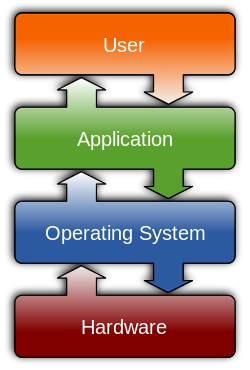

.. include:: ../global.rst

.. index:: operating systems

Operating Systems Goals
=================================
    

   `Wikimedia Commons <http://commons.wikimedia.org/wiki/File:Operating_system_placement.svg>`__ - `CC-BY-SA-3.0 <http://creativecommons.org/licenses/by-sa/3.0>`__
   
When a computer is turned on, the hardware loads code from a set location in permanent memory (generally the disk drive) into main memory. Those instructions load the operating system code and start it up. Once running, the operating system is responsible for starting up application programs and managing the hardware resources that they need. Indeed, most programs are not allowed to interact directly with the hardware - instead, the operating system mediates all interactions between programs and the hardware. 

.. pseudo_h3:: Hardware Allocation
    :class: underlined
    
Most of the hardware resources a computer has are **scarce**, meaning they are in limited supply: The CPU can only do so much work at any given time. There is a physical limit to how much information can fit into main memory (RAM). Only one program can be printing to a printer at any given time.

The operating system is in charge of **allocating** this scarce hardware -  deciding who gets what when and preventing any one program from monopolizing the hardware resources.

.. pseudo_h3:: Hardware Abstraction
    :class: underlined

Computer hardware is diverse and complicated. There are many different kind of storage drives that can be hooked up to a computer - flash, hard drive, CD drive, SSD, etc... and of those styles of drive comes in thousands of makes and models.  Each of those different drives stores information in different ways, often scattered pieces of information across the drive. 

Imagine you are writing a program and want to read a document from a drive. Without an operating system, you would have to write code to talk to a drive, track down all the chunks of information and assemble them into one block in memory. Then you would have to make sure that code worked with thousands of different kinds of drives.

Instead of that nightmare situation, the operating system provides an **abstraction** for dealing with hardware - instead of talking to a drive about chunks of information, your program can talk to the operating system about *"opening a file"*. Because the operating system knows how to look up and retrieve the information that corresponds to that *file* on a wide variety of devices, your program is freed up from worrying about all of the messy details.

.. pseudo_h3:: Common Interface
    :class: underlined

Related to the job of hardware abstraction is providing tools to other programs to interact with users in a consistent and effective manner. Operating systems provide application programming interfaces (APIs) that include tools for doing things like drawing windows. Rather than each application designer deciding what windows should look like, what font to use in the title bar, where to put the close button, etc... the operating system provides code that takes care of those details. Not only does this makes programming an application easier, it also helps enforce a consistent experience for the user.

We could fill books with all the ways that operating systems provide allocation of and abstraction for computer hardware, but on the following pages we will foucs on two fundamental resources: processors and main memory.
