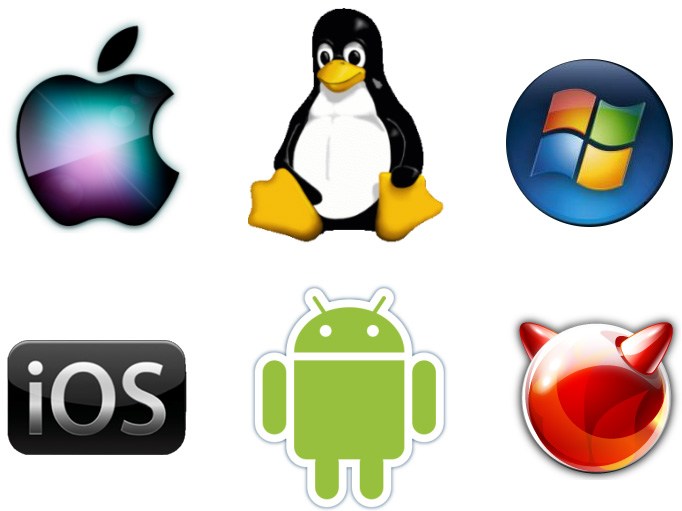

.. include:: ../global.rst

.. index:: operating systems

.. _operatingsystems:

Operating Systems
=================================

An operating system is a complex program that keeps the hardware and software components of a computer system coordinated. Usually, it is the only program that has full access to the computer hardware - its primary task is to manage that hardware and control the ways in which other programs can make use of it.

Although the simplest microprocessors (like those inside simple electronic devices) may not have an operating system, every complex modern computational device uses one. There are a wide range of operating systems, some specialized for running personal computers, others for smartphones and others for more specialized hardware. How many of the operating system logos do you recognize in the image below?

   ..

   Popular operating systems logos. Clockwise from top-left: Macintosh, Linux, Windows, FreeBSD, Android, iOS

.. sidebar:: \*nix

    UNIX is an operating system developed in the 1970s at AT&T. It became the most common operating system for computers in academia and industry. To this day, UNIX-based computers remain popular in environments where developers want unfettered control over how the operating system works.

    There are many "flavors" of UNIX and operating systems based on UNIX (sometimes referred to as "\*nixes"). Apple's OSX is related to a UNIX-based operating system. Linux is a free Unix-like operating system.

Operating systems that solve similar problems on similar hardware tend to themselves be similar. Windows, OSX, and Linux desktops all provide similar ways to view files, and interact with programs because they are used on personal computers with mice and keyboards. Phone operating systems like Android and iOS are similar because they generally operate on devices with smaller screens that are touch-sensitive.

You are probably most familiar with the kind of operating system that runs on a personal computer or smartphone to make it easier to use and program. It is however worth recognizing that there are other types of operating systems designed to run different kinds of hardware or satisfy different constraints.

* Embedded
    An operating system that is designed to operate a particular piece of relatively simple hardware. The emphasis for this type of operating system is on simplicity and efficiency.

* Real-Time
    An operating system designed to handle situations where incoming events must be processed in a fixed amount of time. An example might be the flight controls of an airplane - when the pilot moves the throttle, the control computer cannot afford to ignore that because it is busy doing other jobs.

* Batch
    An operating system optimized to run programs from a list of jobs. The processing time of large scientific computers is too valuable to waste on interacting with humans searching around in folders and typing commands. Instead, programs must be added to the list of jobs the computer is working on - as soon as one job is finished, the next is immediately loaded and started.

.. note:: **What's the deal with Linux?**

    You may or may not have tried working with a PC running Linux - it is an alternative to Windows or Mac OSX for powering personal computers. But it also is the operating system that powers many of the electrical devices in your home, the majority of web servers in the world as well as most big scientific computers.

    Where did it come from? Why is it so popular? This video tells the quick version of the story of Linux and free, open-source software:

    .. youtube:: 5ocq6_3-nEw
        :height: 320
        :width: 570

    `Closed Caption Version <https://smartplayer.captionsync.com/play.php?vid=1521238113sagefreeman_e7627d609d5e>`__
