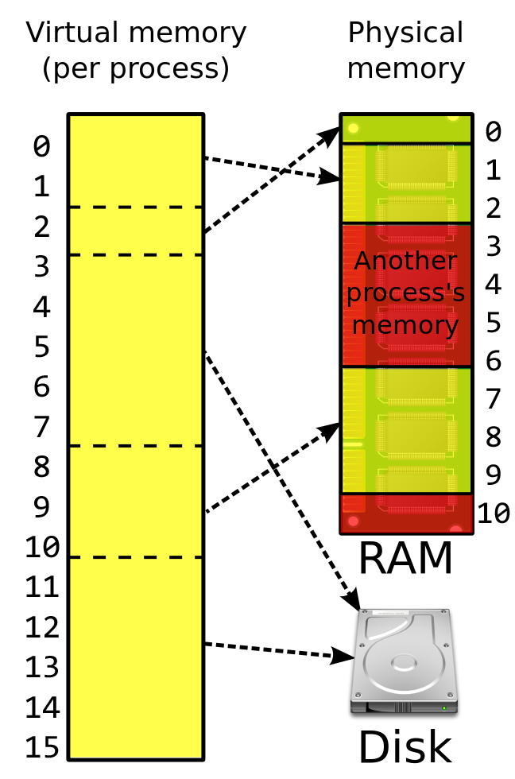

.. include:: ../global.rst

.. index:: memory management

Memory Management
=================================

Modern PC processors often have memory addresses `given by 48 bits <http://en.wikipedia.org/wiki/X86-64#Virtual_address_space_details>`__. That means they can store address :math:`2^{48}` (256TB - over 200 trillion) different byte location. On the other hand, a nice personal computer may only have 8 GB (or ~8 billion bytes) of actual main memory (RAM). In other words, a program may think it can store information in 200 trillion different locations but there are only 8 billion actual places where a byte can go in memory.

Not only are there significantly more addresses that a program is allowed to use than actually exist, every program that is running thinks it gets to use nearly the entire memory space. Two programs may both decide to store a piece of information at byte address #100000 - the operating system needs to make sure that neither program destroys the other's information and that they can both get to what they stored.

Operating systems can address both of these issues through memory address visualization. The basic idea is that the operating system takes any memory reference from a program (a **virtual address**) and remaps it to a location in main memory. What a program thinks is address #100000 may actually be at address #203434. When a second program asks to store information at address #100000, that is mapped to a completely different location, say #834255.

However, all this juggling is completely invisible to running programs. The operating system provides the abstraction of a nice clean sequential set of memory addresses for each program to use while doing complicated tricks in the background to allocate the physical hardware among all the different running processes. The diagram below demonstrates how this works 

If main memory is full, the operating system moves information to secondary memory (like the hard drive) but pretends it is still in main memory (this trick is known as **virtual memory**). Although this allows the computer to pretend there is more RAM available, it also means that any access of that memory involves retrieving it from the hard drive, which is tens of thousands of times slower. When needed, it will be swapped into memory and something else will be moved to the hard drive. If you have ever started up too many programs at once and had your computer grind to a crawl as you switch from one to another, you have seen this in practice - memory is being swapped in/out to the very slow hard drive as you switch from one program to another.

This image illustrates how the process works:
  

    `Image via Wikipedia Commons <http://en.wikipedia.org/wiki/Virtual_memory#mediaviewer/File:Virtual_memory.svg>`__ - `Creative Commons CC BY SA 3.0 <http://creativecommons.org/licenses/by-sa/3.0/>`__
    
    The virtual addresses of a program (left side) mapped onto the physical memory of a computer (right side).
	
This diagram shows a program that thinks access to 16 memory addresses (the virtual addresses). The computer only has 11 addresses in physical memory (RAM). The parts of the physical memory marked red (addresses 3-6 and 10) are in use by other programs and not available to the "yellow" program.

The lines show how blocks of virtual addresses (program memory) are mapped onto the physical memory. The block of virtual addresses numbered 8-10 are mapped to physical addresses 7-9. That means if the program asks for address 8, the operating system would silently say "oh, it means address 7 of RAM, I'll use that". 

Because the program is using more memory than is actually available in RAM, its memory addresses 3-7 and 11-15 are currently being stored on the hard drive. If the program asks for address 12, the operating system would have to move that data into RAM so the data is available to work with. This would mean something else would have to be moved out of RAM and off to the hard drive to make room.

.. pseudo_h4:: Self Check
    :class: underlined

.. mchoice:: virtual_memory1
    :answer_a: 0
    :answer_b: 1
    :answer_c: 2
    :answer_d: It would need to be brought in from the hard drive
    :correct: c
    :feedback_a: That is currently mapped to virtual address 2
    :feedback_b: The block containing virtual address 0 and 1 is mapped to RAM starting at address 1. That means virtual address 0 would match with physical address 1.
    :feedback_c: 
    :feedback_d: Virtual addresses 0 and 1 are currently in RAM
	
    In the diagram above, a program asks for the data at address 1 (virtual address), what physical address would the computer actually access?
	
	
.. mchoice:: virtual_memory2
    :answer_a: 0
    :answer_b: 3
    :answer_c: 7
    :answer_d: It would need to be brought in from the hard drive
    :correct: d
    :feedback_a: That is currently mapped to virtual address 2
    :feedback_b: Physical address 3 is being used by some other program
    :feedback_c: Physical addresses 7-9 are mapped to the virtual addresses 8-10
    :feedback_d: 
	
    In the diagram above, a program asks for the data at address 7 (virtual address), what physical address would the computer actually access?
