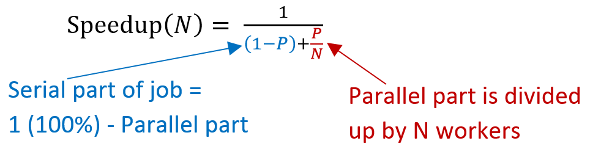

.. include:: ../global.rst

Parallel vs Serial Performance
=================================
    
Having multiple core computers is wonderful if you want to do multiple jobs at one time. But it does not necessarily improve our ability to do any one particular job faster. That is because normal algorithms do not always divide up into equal-sized chunks of work. 

For any given task, there are likely parts that are **serial** (ones that must be done in order) and parts that are **parallel** (that can be done at the same time or even out of order). Say I have a giant pile of index cards with definitions written on them. I want to find one with information about Amdahl's Law and add facts from it to this page but the cards are all jumbled up. Fortunately, I have 4 friends with me. I could divide up the cards, give each person a pile and tell them what to look for. Then all five of us could search our pile. Once someone finds the right card, they can announce it and give it back for me to use. This program might look like:

.. faux_code::

    Divide pile up into 5 stacks                                        ``Serial``
    Hand out one stack to each person and announce what to look for     ``Serial``
    Everyone look for the card                                          ``Parallel`` 
    Give the card to me                                                 ``Serial`` 
    Add fact to page                                                    ``Serial`` 

Searching piles for the right card should only take 1/5th as long with 5 people looking. But dividing up the piles, communicating and typing up the fact will not go any faster. I could add 95 more friends and cut the "looking" phase down to 1/100th of the original time, but that won't help me type the information we find up any faster. We can speed up parallel parts by doing them simultaneously, but serial portions can not be sped up.

The figure below on the left shows how the total time depends on how much work can be split up and how many workers we have. The one on the right compares the total time on a hypothetical job done by 1-5 workers. Notice that although more workers means less time on the parallel part, the serial part always takes the same time.

.. container:: inlinegroup

    .. figure:: Images/amdahl1.png
        :figwidth: 45%
        
        Effect of splitting the parallel part of a job in 5.
        
        
    
    .. figure:: Images/amdahl2.png
        :figwidth: 45%

        Going from 1 to 2 workers has more effect than going from 4 to 5.

|br|
       
.. index:: amdahl's law

This feature of diminishing returns from extra workers due to a serial portion of problems is captured by a formula known as **Amdahl's Law**. It predicts the speedup possible given: **P**: the percentage of the total work that is parallel (expressed as a decimal) and **N**: the number of ways we split the work.

The bottom of the fraction represents the percent of the original time we will take - this equals the serial part plus one share of the parallel part. Dividing 1 by that gives us how many times faster we are working.

Say 60% of a job can be made parallel and we use 2 processors. Substituting .60 for **P** and 2 for **N** into the formula gives:

:math:`\textrm{Speedup}(N) = \frac{1}{(1-P) + \frac{P}{N}} = \frac{1}{(1-0.60) + \frac{0.60}{2}} =  \frac{1}{0.40 + 0.30} = \frac{1}{0.70} = 1.43`

We would see a speedup of 1.43 times. 40% of the work needs to be done in serial. The other 60% is split into two equal parts, so instead of taking 60% of the time only takes 30%. So we can get the work done in 70% of the original time, or 1.43x faster.

Let's say we use 3 workers on the same job:

:math:`\textrm{Speedup}(N) = \frac{1}{(1-P) + \frac{P}{N}} = \frac{1}{(1-0.60) + \frac{0.60}{3}} =  \frac{1}{0.40 + 0.20} = \frac{1}{0.60} = 1.67`

40% of the work still must be done in serial. The 60% that is parallel will only take 20% or the original total time. Thus, the work gets done in 60% of the original time or a speedup of 1.67 times.

Better, but we are already seeing the diminishing returns of multiple workers. The first extra worker made the process 43% faster - the second extra worker only increased by 24% more. If we try putting 60 workers into that formula it predicts a total speedup of only 2.43x over one worker! Even an infinite number of workers would only speed things up by a factor 2.5 times... because 40% of the job is serial it can never be done in less time than that.

The image below shows the speedup possible for jobs with 50%, 75%, 90% and 95% parallel portions. 

.. figure:: Images/AmdahlsLaw.png

   `Wikimedia Commons <http://en.wikipedia.org/wiki/Amdahl's_law#mediaviewer/File:AmdahlsLaw.svg>`__ - `CC-BY-SA-3.0 <http://creativecommons.org/licenses/by-sa/3.0>`__
   
   Even on a problem that is 95% parallel, we can never see more than a 20x speedup no matter how many processors we have.

Amdahl's Law makes it clear that parallel processing is best on tasks that are **embarrassingly parallel** - where only a tiny fraction of the work is serial. For other problems, there is a hard limit to the gains possible.

In fact, Amdahl's law is too optimistic! In general, each worker (core) you add increases the total amount of work to do. Thinking back to the earlier example of organizing note cards, imagine the difference between managing 4 helpers and 99. It would take significantly more time to split up and distribute work to 99 people. If the pile of cards was large enough, we would probably still come out ahead, but at some point adding more workers will start to slow us down. There are many such ways in which adding workers can increase the work that needs to be done:

* Time to divide the problem up into chunks 
* Time to hand out chunks of work to workers 
* All workers may not work equally fast
* Some workers may flake out (crash). The more there are the more likely this is
* There may be contention for shared resources 
* You may have to wait until the last worker returns to proceed (the slowest / weakest link problem)
* It may take time to merge results from different workers

