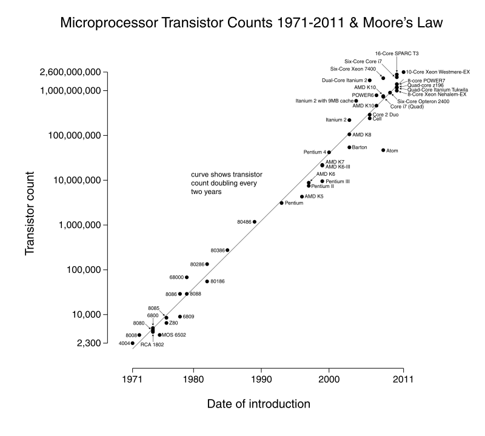
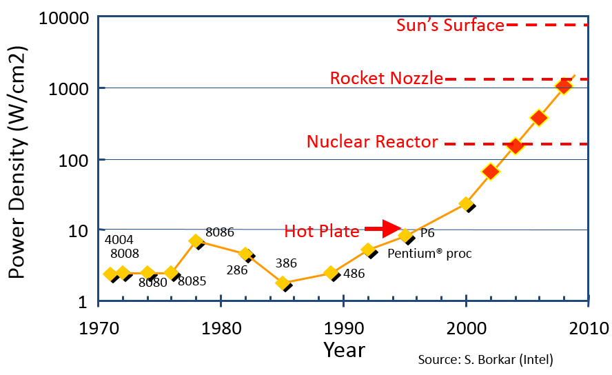

.. include:: ../global.rst

.. index:: moore's law

Moore's Law
=================================
    
.. sidebar:: Gordon Moore

    .. figure:: Images/Moore.jpg

        Image © Intel Corporation
    
    
In the 1960's, Gordon Moore, one of the co-founders of Intel, noticed that integrated circuits were becoming more complex at an exponential rate. He predicted that this growth would continue - that the number of transistors on a circuit would double every two years. This prediction came to be called **Moore's Law**. Although Moore's Law talked only about the number of components on a chip, other people have modified it to attempts to predict overall performance increases based on increases in both complexity and speed. The generally quoted number for overall processing power growth is a doubling every 18 months.

Using the pattern of doubled power every 1.5 years, that means that a processor that comes out today is roughly 4x more powerful than one from 3 years ago and 16x more powerful than one from six years ago. (Which helps explain why computers need to be upgraded so frequently.) This doubling of computing power in a chip every 1.5-2 years has held steady for the past 40+ years. 

To put this kind of growth into perspective: If Moore’s Law applied to the air travel industry, a flight from New York to Paris that took 7 hours and cost $900 in 1978 would now require about 1/10th of a second and cost under a penny.

    

   `Wikimedia Commons <http://en.wikipedia.org/wiki/Moore's_law#mediaviewer/File:Transistor_Count_and_Moore%27s_Law_-_2011.svg>`__ - `CC-BY-SA-3.0 <http://creativecommons.org/licenses/by-sa/3.0>`__
   
   Transistor count of various processors over past 40 years. Note that y-axis is a logarithmic scale - the straight line represents exponential growth.
   
Unfortunately, the "free ride" of increased power that computer programmers and users have enjoyed has hit some speed bumps. Partly, this is the necessity of squeezing transistors into ever smaller spaces. Currently, features on chips occupy ~20 nanometers, a span of less than 100 atoms, we do not have too much longer before the size of atoms becomes a barrier to making chips smaller.

Equally importantly, making chips run faster requires more power. Power running through a chip results in waste heat that must be dissipated - only so much power can be used (and thus heat generated) before a chip becomes uncontrollably hot. The image below shows the path chip designers were on in the early 2000's... an unsustainable path in terms of how much power draw was being packed into ever smaller spaces.

   Image from `Beauty and Joy of Computing by University of California <http://bjc.berkeley.edu/>`__ - `CC-BY-SA-3.0 <http://creativecommons.org/licenses/by-sa/3.0>`__
   
   Projected power density growth through the early 2000's. Red dots show predicted path.

