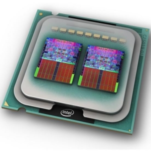

.. include:: ../global.rst

Multi Processing
=================================
    

    
    Image © Intel Corporation 
   
    Multiple processing cores on one chip
   
In the year 2002, Intel's flagship consumer processor was the Pentium 4 running at 3.06 GHz (meaning the CPU clock ticks 3 billion times per second). The architecture of this processor was supposed to scale up to 10 GHz, but by 2005, Intel had to abandon the architecture as the power density of the chips was becoming unmanageable. Intel shifted to a new strategy and architecture called the Core architecture. 

These new chips were not clocked as fast as the ones they replaced, but they featured multiple processing cores.  Chip designers had figured out that by reducing the clock speed by say 20%, they could also reduce the voltage, cutting the power required by the processor nearly in half. The chip might not be quite as fast, but because processors were getting smaller anyway, you could fit two or more on the same chip. The two processing cores would thus use the same amount of power as one faster chip, but spread the power out over twice the area, making it easier to manage. Each of these processing cores can work independently - assuming they each can process 80% of what one higher speed chip could, that means a 60% increase in processing power.

=============================================  ==============================  ==============================
\                                               1 Fast Core                     2 Cores
=============================================  ==============================  ==============================
**Speed**                                       100%                            80% each
**Power**                                       100%                            100% (50% each)
**Area**                                        1                               2
**Power Density**                               100%/1 = 100%                   100%/2 = 50%
**Instruction Processing Power**                100%                            160%
=============================================  ==============================  ==============================

Now days, just about every computer processor is **multi-core**. Personal computers routinely come with four or more processing cores. Computer graphics cards have thousands of processing units (though they are optimized to perform specific types of jobs). Super computers, like `IBM's Watson computer that beat the best human Jeopardy players <https://www.youtube.com/watch?v=FC3IryWr4c8>`__, combine thousands of processors into room sized devices.

