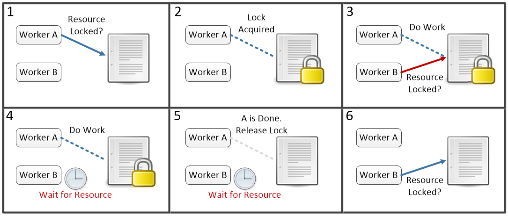
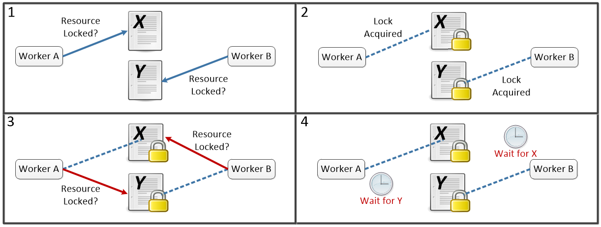

.. include:: ../global.rst

Synchronization
=================================
    
When two or more workers are doing tasks that can affect the results of each other, synchronizing their actions can become critical. Say two processing cores try to do these two jobs (assume that ``x`` refers to a location in memory where the value 5 is stored):

.. container:: inlinegroup

    ..  faux_code:: 
        
        \     **Worker A's Task**
        1   get ``x`` from memory
        2   add 10
        3   store total to ``x`` in memory
        
    ..  faux_code::
        
        \     **Worker B's Task**
        1   get ``x`` from memory
        2   add 1
        3   store total to ``x`` in memory

|br|        

Depending on the timing, we could end up with 15, 6 or 16 stored as the value for ``x``! How? Well, we know that each worker will do their three steps in order, but we have no guarantee on the relative ordering between the two workers.

* A finishes completely (``x`` now 15) and then B goes (``x`` now 16)
* B finishes completely (``x`` now 6) and then A goes (``x`` now 16)
* A1 runs, program A gets 5. B1 runs, B gets 5. B finishes steps 2 and 3, (``x`` now is 6). Then A finishes steps 2 and 3 but using the value of 5 it already retrieved (``x`` now is 15)
* A1 runs, program A gets 5. B1 runs, B gets 5. A finishes steps 2 and 3, (``x`` now is 15). Then B finishes steps 2 and 3 but using the value of 5 it already retrieved (``x`` now is 6)

The potential for different results depending on which worker acts first is called a **race condition** and leads to nasty bugs in programs (you likely only see the error occasionally, making it very hard to track down).

.. pseudo_h3:: Locks and Deadlock
    :class: underlined
    
One solution to synchronization issues is to add **locks** to certain resources (like pieces of memory or hardware). Before using a locked resource, a worker has to check if anyone else already has locked it. If not, the worker *acquires a lock* - marking that resource as in use. When it is locked, anyone else who wishes to use it must wait until the lock is released.

    A worker trying to access an already locked resource must wait for the existing lock to be released

In the example above Worker A gets to a resource first and acquires a lock (step 1). Thus when B checks in step 3, it finds out it will have to wait until the resource is free. At some point after the lock is released (step 5), B will go try again to see if the resource is free. Note that for this scheme to work, we need a command "check and acquire lock" that can be done as one **atomic** action - in other words, there is no actual gap between steps 1 and 2 - they can never be separated. If someone else could act between steps 1 and 2 there would be no guarantee that the resource that looked free to A in step 1 was still free in step 2.

Introducing locked resources has some big drawbacks. First, by definition, any work that is happening on a locked resource is serial - only one worker can do anything with the resource at a time. The more time code spends working within locks, the less able workers are to run in parallel. Second, we introduce the possibility for a **deadlock**. Say we have two workers that both need to use two locked resources, X and Y to complete their work. We could end up in a situation where each is waiting for the other to release a lock it needs:

    Once we reach step 4 both A and B will be stuck waiting for the other one to finish.

Deadlock depends on three criteria being met:

* Mutual Exclusion
    Only one worker can access a resource at a time. 
    Any time we allow locks, this will be met. Only by allowing both workers to access the resource at the same time can we avoid this. 
* Hold and wait
    A worker can hold onto a lock while they wait on another resource. 
    We might be able to avoid deadlock if in step 4 both workers had to release their existing lock and start over trying to acquire a lock on both X and Y. (To avoid going right back to step 1 every time, we might make each Worker wait a small random amount of time before trying for the locks).
* No Preemption
    No one can be forced to give up their lock. 
    We could say that Worker A can make B give up a lock if they want. Or we could say that anyone who has the lock on X can make someone else give up their lock on X.
    
None of the possible fixes mentioned to the conditions for deadlock are without issue. We can very easily end up "starving" one worker who is forced to wait all the time for their resources. It is also notoriously hard to figure out in advance exactly who needs to lock what resources for how long and how conflicts should be resolved - even experienced programmers can easily make small mistakes that go unnoticed but lead to crashes or data corruption.

