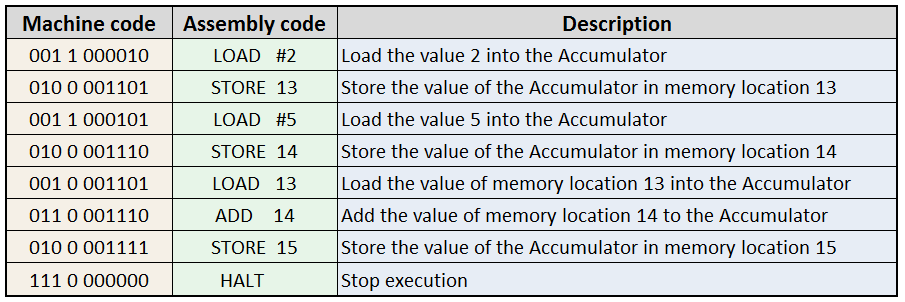

.. include:: ../global.rst

.. index:: assembly languages

.. _assembly-languages:

Assembly Languages
=================================

Because strings of 0s and 1s are so hard for people to read, **assembly languages** were invented. An assembly language is essentially a human-readable direct translation of machine language. Each assembly instruction generally directly matches one machine instruction. The only difference is that instead of writing "0100001101" to say "store the current value to memory location 13" as you would in machine language, in assembly you could write something like "STORE 13". 
 

    
The image above shows an imaginary list of machine instructions, along with what they might look like in assembly. Do not worry about the details of this particular assembly language or machine language, just recognize that each instruction is just a translation of the machine code. Each "LOAD" instruction corresponds to a machine instruction that starts with the opcode 001 which means load; each "STORE" instruction corresponds to a machine instruction that starts with the opcode 010.

Although assembly is much easier to read than machine code, you probably noticed that it is still very low level. A job as simple as "add 2 and 5" took many instructions to express. For this reason, most programmers do not work in assembly most of the time. 

However, assembly is the way that machine code is displayed in a human-readable format. Since all programs at some point become machine code, that means when a programmer is debugging a program at a low level, they will often be looking at assembly. There are also times, typically when working on an **embedded processor** (the kind of simple processor built into an electric device) when a programmer has to interact with the hardware at a very low level - in that situation assembly is the tool they use.

.. quick_attribution:: VT