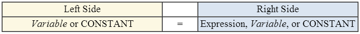

.. include:: ../global.rst

.. index:: assignment statement

Assignment Statements
=================================

.. sidebar:: Constants

    A constant is a variable that is not allowed to change. Preventing unwanted changes can help prevent bugs.
        
Once a variable has been used to associate an identifier (name) with a location in memory, we need to be able to **assigning** it a value - to modify the bits stored at that memory location. An **assignment statement** is a line of code used to modify the value a variable refers to. Assignments statements generally look like:

Though most programming languages use = to mean assignment, it does not really mean "equals". Instead it means "take the value that is on the right side and place it into the location named on the left side" or "assign the value on the right side to the variable on the left side". For this reason, sometimes programmers use := or <- to show assignment.

On the rights side can be a value::

    PriceOfShoes = 19.95

Or another variable - this would say "copy the value stored in CurrentCount into MaxCount" making them both have the value 10::

    CurrentCount = 10
    MaxCount = CurrentCount
    
 
Or a combination of variables and values combined in a mathematical expression. We might say the following to calculate someone's grade as the average of their work and tests (usually / means divide and * means multiplication)::

    CourseGrade = (TestGrade + WorkGrade) / 2
       
.. image:: Images/VariablesAndAssignment.swf
    :width: 580
    :height: 430

.. quick_attribution:: VT