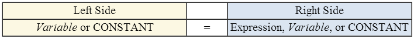

.. include:: ../global.rst

Assignment Statements Tricks
=================================

Learning to think in terms of assignment statements is one of the first big hurdles in learning to read and write code. They key is to keep in mind that what they really say is "copy the value on the right side into the location on the left". Unlike equations in math, which also use the = symbol, assignments statements are directional. You can not switch what is on the right and right side:

Because assignment statements say "take the value on the right side and store it into the location named on the right side", the left side must **only** have the name of one variable. This makes sense::

    A = B + C

It means "add up the values at locations B and C and put the answer in the location A". This does not:

.. rst-class:: red

    .. faux_code::
        
        B + C = A
        
It says take the value from A and put it at "B + C". There is no location called "B + C", so that would be an error and the computer would refuse to run that line.

The "directionality" of assignment also means that "A = B" is different than "B = A". Try running these two mini programs - run each to the end with their Forward buttons and compare the values each program ends up with for A and B:

.. codelens:: AequalsB

    A = 4
    B = 5
    A = B
    

.. codelens:: BequalsA

    A = 4
    B = 5
    B = A
    
Finally, there is the mystery of this line of code::

    x = x + 1

In math, that equation does not make sense. It does not have a solution. But since assignments statements say "take the value on the right and store it into the thing on the left", in programming it says "take the current value of x, add one to it, and store that answer back as the new value for x". Try running the following program:
    
.. codelens:: incr

    x = 2
    x = x + 1
    
Believe it or not, computers spend quite a lot of time simply adding one to a value.
    
.. pseudo_h4:: Self Check 
    :class: underlined

.. mchoice:: questionanalog_1
    :answer_a: x = 6, y = 4
    :answer_b: x = 6, y = 6
    :answer_c: x = 4, y = 6
    :answer_d: x = 4, y = 2
    :correct: c
    :feedback_a: x is only assigned to on the first line...
    :feedback_b: x is only assigned to on the first line...
    :feedback_c: 
    :feedback_d: x on the right side of the = means get the current value of x
    
    What is the result of doing this series of assignments?
    
    x = 4
    
    y = x + 2
    
    
.. quick_attribution:: VT