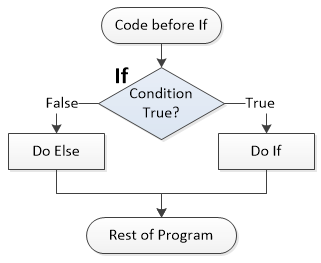

.. include:: ../global.rst

.. index:: conditional statements

Control Structures & Conditionals
=================================

Generally, programs run one instruction at a time, from top to bottom. But there are times when we need to make decisions about how to proceed. Maybe we only need to do a step in a calculation if certain conditions are met. Maybe we need to go back and repeat some instructions again until we get an answer we like. To handle these kinds of situations, we use **control structures**. Control structures change the order instructions are executed in, breaking the normal top to bottom flow.

The primary control structures are: Conditionals, Loops and Subprocedure calls.

.. pseudo_h3:: Conditionals
    :class: underlined

**Conditional statements** allow us to specify that certain parts of the code will only run under certain circumstances. They generally take the form of an **if statement**. If statements specify a Boolean (true or false) condition that must be true for the code inside the if to execute::

    1   If (This condition is true) Then:
    2       Do this special thing
    3       And this
    4    
    5   No matter what, do this. 
    
The indentation shows that statements 2 and 3 are "inside" the if. They only execute if the condition is true. Otherwise, we skip them completely. Often times, we will expand an if statement with an else clause to specify two alternatives::

    1   If (This condition is true) Then:
    2       Do this special thing
    3       And this
    4   Else:
    5       This only happens if condition was NOT true
    6       So does this
    7    
    8   No matter what, do this. 

    
If the condition is true in line 1, lines 2 and 3 are executed, then we would skip down to line 7. On the other hand, if the condition is not true, we skip 2 and 3 and do the lines inside the Else. 

Think of an If/Else as a choice between two paths through the code. Note that either way, after executing either the if or the else, we continue on with the rest of the code in the program.

.. important::
    :class: clear

    Indentation or some other system (some languages use { } to show the start and end of a group of lines) is critical to show what actually depends on the condition. This (bad) attempt at writing a condition would always print out "Looks sunny" - the print is not indented to be part of the if. (The if says "If the temperature is above 80, do nothing special.")::
    
        1   If temperature > 80 Then:
        2   print "Looks sunny"
    
The condition is usually written by doing a logical comparison - asking if two values are equal or not equal, or if one is larger than the other. Because = usually means assignment, to specify comparing two things to see if they are equal, we often use == to mean "equals" and because things like :raw-html:`&#8804;` are hard to type, we use <= to mean "less than or equal".

============    ==================  ==================  =======================================
Symbol          Meaning             Example             Example Meaning
============    ==================  ==================  =======================================
==              is equal            a == b              a is equal to b
!=              not equal           a != b              a is not equal to b
>               greater than        a > b               a is greater than b
>=              greater or equal    a >= b              a is greater than or equal to b
<               less than           a < b               a is less than b
<=              less or equal       a <= b              a is less than or equal to b
============    ==================  ==================  =======================================
    
Compare the execution of these two programs. All that is different between them is what the variable ``outsideTemp`` is set to at the beginning of the program. That variable affects which path through the program the code takes. This first version starts with a temperature of 45:

.. codelens:: IfStatement

    outsideTemp = 45
    print "Lets check the weather"
    
    if (outsideTemp > 60):
        print "Doesn't look too bad out."
    else:
        print "You are going to need a jacket!"
        
    print "See you later"

This second version starts with a temperature of 85:
 
.. codelens:: IfStatement2

    outsideTemp = 85
    print "Lets check the weather"
    
    if (outsideTemp > 60):
        print "Doesn't look too bad out."
    else:
        print "You are going to need a jacket!"
        
    print "See you later"           
