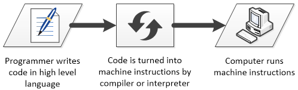

.. include:: ../global.rst

.. index:: high level languages

.. _high-level-languages:

High Level Programming Languages
=================================

.. sidebar:: FORTRAN

    The first high-level language, Fortran (FORmula TRANslating system) was designed in 1954. Like many developments in computation, it came from someone looking to get out of doing tedious work. Its creator, John Backus, said *"Much of my work has come from being lazy... and so when I was working on the IBM 701, writing programs for computing missile trajectories, I started work on a programming system to make it easier to write programs."*

It is rare for programmers to write programs directly in machine language or assembly. The executable files for most applications contain hundreds of thousands or even millions of machine language instructions. It would be very hard to create something like that from scratch.

**High-level programming** languages were invented to abstract away the details of machine code and help programmers to concentrate on problem-solving. While it might take 3 or 4 lines of code to add two numbers using assembly language, this task could be accomplished with a single instruction in a high-level programming language like C++, Java or Python. With a high-level language, a programmer creates a program using powerful, "big" operations which will later be converted into many little machine operations.

.. index:: compiler, interpreter

Programs written in a high-level language must be converted into machine code to run. This is either done ahead of time by converting a whole program to machine code with a **compiler** program (compiling the code), or line by line as the program runs by an **interpreter**. One line in a higher-level programming language might turn into anywhere from one to dozens or more machine instructions. Not only does that mean there is less code to type, but it also means there is less code to debug - when something goes wrong, it is often easier to track down.

The tabs below show what code might look like in various language levels. Imagine we are designing software for the sales terminal in a restaurant; we are going to look at the part of the code that might calculate the 15% tip that is automatically added to large groups. (Note: all the languages are made up samples of a particular level - don't worry about the details of any of them.)

.. tabbed:: example1

    .. tab:: English

        To calculate the total amount owed, first, multiply the total price of the meal by 0.15. This gives you the tip for the meal. Then, add that to the price of the meal to find the total bill.

    .. tab:: High-Level Language
    
        ::

            tip = mealCost * 0.15
            bill = mealCost + tip
        

    .. tab:: Assembly
    
        ::
            
            LOAD    MealCost
            MULT    TIPRATE
            STORE   Tip
            LOAD    MealCost
            ADD     Tip
            STORE   Bill
            
    .. tab:: Machine Code
    
        ::
        
            0101010111100101
            1111011010101110
            1101101010010101
            0101110110001111
            0001010101111100
            1101101010111111
            
Note that the high-level language is much more compact than the assembly or machine code and, even more important, it allows us to express an algorithm at a level much closer to the actual problem domain. Instead of worrying about LOADing and STOREing values into registers, we can express commands that look more like normal calculations: ``tip = mealCost * 0.15``.

.. quick_attribution:: VT ICSJava