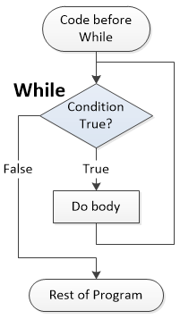

.. include:: ../global.rst

.. index:: loop statements

Loops
=================================

A **loop statement** specifies that a chunk the code inside of it may be run more (or sometimes less) than 0 times. A very simple loop might show that some commands are to be repeated a certain number of times::

    1   Repeat (5) Times:
    2       Do this thing
    3       And this
    4
    5   Then this only once

The program would run line 1, then 2, 3, 2, 3, 2, 3, 2, 3, 2, 3, then finally 4 and 5. Like with a conditional statement, the indentation show the lines of code that need to be more than once.

Often loops are written with a condition. A **while loop** says to repeat everything inside of it as long as the condition is true::

    1   While (This condition is true):
    2       Do this thing
    3       And this
    4
    5   Then this only once

The condition of a **while loop** works just like that of an **if statement** but, after the body of the while statement (the commands that are indented "inside" it) are run, the program jumps back up and checks the condition to see if we need to do them again.

.. rst-class:: clear

Try running this program. Notice now we keep repeating lines 5-7 until the current number is no longer greater than 0.

.. codelens:: While

    currentNumber = 5
    print("Let's sing a song!")

    while (currentNumber > 0):
        print(currentNumber, " bottles of root beer on the wall,")
        print(currentNumber, " bottles of root beer")
        currentNumber = currentNumber - 1

    print("No more bottles of root beer on the wall.")

It is a silly program, but it shows how loops can be used to avoid repeating ourselves (do not have to type lines 5 and 6 five times each) and to handle an unknown amount of work. We could easily change the program to start currentNumber to 100 or ask the user for a starting value; without changing anything but line 1 of the program, we would then get 100 versions of the song's refrain.
