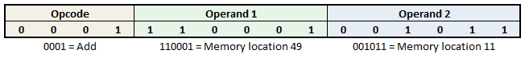

.. include:: ../global.rst

.. index:: machine language, opcode

.. _machine-languages:

Machine Languages
=================================

Suppose for a moment that you were asked to perform a task and were given the following list of instructions to perform:

#. 0001 0011 0011 1011
#. 1101 0111 0001 1001
#. 1111 0001 1101 1111
#. 0000 1100 0101 1101
#. 0001 0011 0011 1011

These instructions have no real meaning to you, but they are exactly the kind of instructions that a computer expects. It only knows how to deal with 0s and 1s, so all of its instructions must be written in binary format. A processor's control unit has a format it expects each such instruction to be in: typically a instruction will be a set length, say 16 or 32 or 64 bits and the first few bits will specify what kind of instruction it is. These first few bits, known as the **opcode** (operation code), say what general task is to be done - something like "store a number" or "add two numbers". The rest of the instruction will contain **operands**, the extra information needed to understand the instruction - things like where to store the number or which two numbers to add.

The figure below shows how an imaginary computer might interpret an instruction. The first 4 bits are the opcode - in this case, we are assuming 0001 means "add two values". The next 6 bits specify the memory address of the first number we are adding and the last 6 bits specify the memory address of the second number.

    
    ..
    
    How a computer might interpret the instruction 0001110001001011.

Computers usually support only a small number of machine code instructions; a few dozen to a few hundred very simple instructions like "add two numbers" or "store a value to memory". The list of available instructions and the format for specifying them make up a **machine language**. Machine languages were the first programming languages - the earliest electronically programmable computers had to be programmed by feeding in a program as a list of 0s and 1s that specified what the computer was to do. (Before that the program had to be set physically with switches or patch cords.) 

.. important::
    Because these are the only instructions a computer actually can understand and perform, at some point, every program a computer runs must be converted to machine instructions. 

    
You can probably see the difficulties of working in machine language. While it might be very appropriate for a computer, it is extremely confusing for a computer programmer. They are also restricted to very low-level commands. There is no way to say something like "open a connection to google.com" or "draw this image on the screen" in a machine language - instead you would have to break those tasks down into much lower-level commands that would accomplish your goal.

.. quick_attribution:: VT