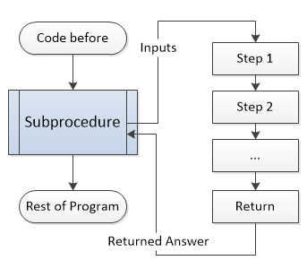

.. include:: ../global.rst

.. index:: subprocedures, functions, parameters

Subprocedures
=================================

The last major control structure that all high level languages supply is the idea of a **subprocedure** often called **functions**. A subprocedure is a chunk of code that does a particular task. It is essentially a small program that may take some input, does some work and then can give back an answer.

Ideally, a subprocedure works like a black box - we pass some information into it and receive an answer out of it. It is very similar to the mathematical idea of a function, only not every subprocedure has inputs or outputs. The inputs given to a subprocedure, if any, are called the **parameters**. The answer received, if any, is called the **return value**. Making use of a subproceudre is known as **calling it** - try calling the ``Power`` subprocedure below by passing in values for x and y and pressing the button.

.. figure:: Images/callpower.swf
   :width: 550
   :height: 350

   `Animation used by permission of Virginia Tech <http://courses.cs.vt.edu/csonline/>`__

   

   
The value of subprocedures lies in this black box behavior. You do not need to know how Power works to use it in your program, just that it takes two inputs and returns a single answer. Once someone has written a subprocedure, others can build other code that makes use of it without worrying about the details. The ability to think in higher level abstractions like "calculate this exponent" instead of the low level implementation helps save programmers time and mental energy.

.. note::
    :class: clear
    
    Abstractions are one of the most powerful tools in programming. Modern programming languages feature large libraries of subprocedures to do things like draw images and form internet connections. These allow application developers to focus on building programs from these high level behaviors instead of spending all their time wrangling 0s and 1s.

If we watch behind the scenes, we can see the kind of instructions that might make ``Power`` might do its job:

.. figure:: Images/tracepower.swf
   :width: 550
   :height: 350
   :class: clear

   `Animation used by permission of Virginia Tech <http://courses.cs.vt.edu/csonline/>`__

    
Of course, the computer needs actual instructions like these for how to do the work. Someone somewhere must write the code for this ``Power`` procedure. But once that code is written and tested, it can be reused, avoiding the need to constantly reinvent the wheel.

