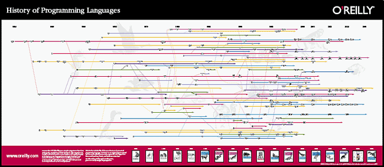

.. include:: ../global.rst

.. index:: syntax

Variety and Syntax
=================================

Since the first high level language, FORTRAN, there have been hundreds of programming languages developed. Each new language builds on ideas found in earlier programming languages. Sometimes they are designed just to test a particular idea or just for fun, but usually a new language includes features designed to make some particular task easier to accomplish.

    
    O'Reilly publishing history of programming languages
    
    A genealogy of computer programming languages - click to expand.

.. sidebar:: Hello World

    Hello World is traditionally one of the first programs people write when learning a new programming language - a simple program to just print he words "Hello World" on the screen.
    
    You can find hundreds of `examples of Hello World in different languages here <http://www.roesler-ac.de/wolfram/hello.htm>`__ .
    
Each of these languages has its own **syntax** - the rules that govern what makes a legal statement in the language. Oftentimes languages borrow syntactical elements from each other and thus look similar, but every programming language has differences in what you can say and how you say it.

Human languages have syntax rules as well - in English we consider "I ate the red apple." to be a sentence, while "ate. I red the apple" is nonsense. Programming languages are much stricter than human languages, but the biggest difference is the listener. We depend on humans to understand things even when there is a slight syntax error in something we say or write. (`Though mistakes do happen <http://en.wikipedia.org/wiki/Eats,_Shoots_%26_Leaves>`__). Computers however are not so forgiving - they are not clever enough to figure out what you meant, so if you have an error that violates the syntax of their language they will not even try to execute it.

Although each programming language has its own rules, there are some basic concepts that most programming languages have in common. There are programming languages that work in fundamentally different ways, but most programs are written languages that all work in a fairly similar way (what is known as the imperative style of programming). We will explore some of the critical building blocks that languages provide in the next few pages. 

    
