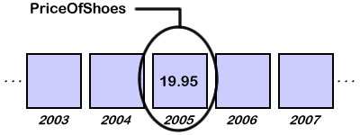

.. include:: ../global.rst

.. index:: variable

Variables and Data Types
=================================

The first important concept in programming languages is the idea of **variables**. Variables are mappings of descriptive names, called **identifiers**, to locations in the computer's memory. Once a memory location is given an identifier, we can refer to the value stored in that location using the identifier rather than having to know a numeric address. Most of the time a programmer will not care exactly what memory addresses hold which pieces of information, just that it is there and accessible by a name.

For example, suppose you wanted to write a simple program to calculate the amount of sales tax you will need to pay on a new pair of shoes that costs $19.95. Like every other piece of information the program needs to work with, the price of the shoes will be stored in a variable. Variables generally must be given single word names, so often they are written by smashing words together like ``PriceOfShoes``. Once that name is associated with a location in memory, the value 19.95 must be stored there.

.. index:: data type

In addition to identifying a location in memory, variables identify the **type** of information that can be found at that location. Remember that in memory, ``PriceOfShoes`` will not be stored as 19.95 but as 0s and 1s that could mean anything. The computer needs to know that those 0s and 1s are to be interpreted as a floating point number and not as an integer or an image. The kind of thing a variable represents is known as its **data type**. There are only a couple basic kinds of data type that most computer languages use:

* Integers
    Sometimes there are different types for unsigned (only positive using :ref:`standard binary representation<binary-conversion>`) and signed (positive and negative values using :ref:`two's complement notation<twos-complement>`).
* Reals
    Also known as floats. Values that can have a fractional part and are stored as :ref:`floating point values<floating-point>`.
* Characters.
    Single letters stored in :ref:`ASCII<ascii>` or some other encoding. In code, these often have single quotes around them like 'A' or 'B' or 'C'.
* Booleans
    Values that can only be true or false. Used for making decisions. We might use a variable ``OvernightShipping`` to remember if someone asked for express delivery. In that case we would probably have an instruction somewhere that looked like: "if ``OvernightShipping`` add $5 to price".
* Arrays
    A list of related items of the same type - say a list of test scores for a class.

To specify what kind of information you are talking about, some programming languages make you specify the type of variables::

    real PriceOfShoes
    integer DaysInWeek

In other programming languages you do not specify what type of information is, the compiler or interpreter just does its best to figure out what kind of information you are working with. Though this can make programming easier, it can also lead to surprises when the computer guesses the wrong type.

.. image:: Images/types.swf
    :width: 580
    :height: 450

Of course, programs work with more complex types of information all the time. But these complex types are built by combining simpler items. To represent a piece of text in a program (usually called a **string**) we would combine an array of Characters that represent the letters with an Integer that stored the length of the string. We might represent a calendar date by combining three Integers, one each to store the day, month and year. These complex data types built from a collection of simple variables are generally referred to as **structs** or **objects**.

.. quick_attribution:: VT
