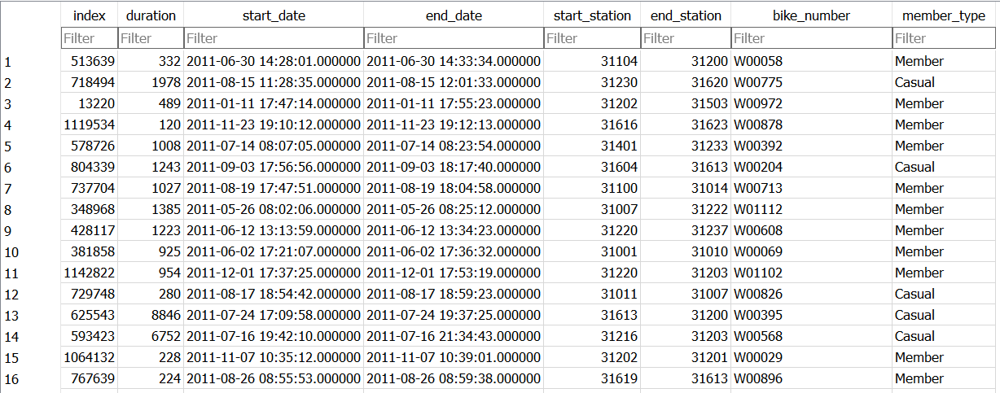
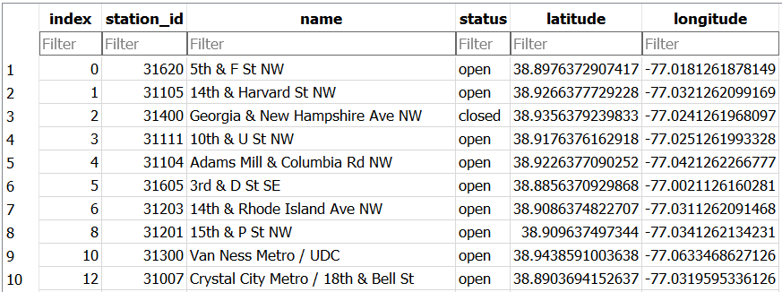

.. Copyright (C)  Google, Runestone Interactive LLC
   This work is licensed under the Creative Commons Attribution-ShareAlike 4.0
   International License. To view a copy of this license, visit
   http://creativecommons.org/licenses/by-sa/4.0/.

Tables of Records
===========================

.. index::
    pair: SQL; SELECT

Say you are conducting research about bike sharing for an
internship in Washington D.C. You are given the Capital Bike Sharing dataset,
contains information on Washington D.C.'s bike share program for 2011. The database
has hundreds of thousands of records about every ride that anyone took and you would
like to look for patterns in the data to understand questions like: "How long is
the average ride?" and "Where is the most popular place to start a ride?"

In a database, the data is arranged in **tables** like the one shown below. This ``trip_data``
table has all of the information about individual trips that were made. Each
row in a table is a **record** - here, each record is an individual trip someone made.

.. _trip_data:

The columns are the pieces of data associated with each record. Here is a description of
the columns available in the ``trip_data``:

.. list-table::
    :widths: 30 70 
    :header-rows: 1
    :align: left
    :name: trip_data_table

    * - Column Name
      - Description
    * - index
      - A unique number that identifies the trip
    * - duration
      - The time in seconds of the trip
    * - start_date
      - Date and time the bike was checked out
    * - end_date
      - Date and time the bike was returned
    * - start_station
      - Station number the bike was checked out at
    * - end_station
      - Station number the bike was returned at
    * - bike_number
      - Which bike was used
    * - member_type
      - Type of user - Casual (one time), or Member

.. note:: 

    Don't worry about memorizing all of the columns, you can check back here as needed.

.. _bikesharestations:

Information about the stations is stored in a separate table called the ``bikeshare_stations``
table. In that table, each record is the information about one particular station.

It has these columns:

.. list-table::
    :widths: 30 70 
    :header-rows: 1
    :align: left
    :name: bikeshare_stations_table

    * - Column Name
      - Description
    * - index
      - A number that identifies the record (1, 2, 3...)
    * - station_id
      - A unique number that identifies the station
    * - name
      - The name of the station
    * - status
      - If the station is open or closed
    * - latitude
      - Latitude (North-South position) of station
    * - longitude
      - Longitude (East-West position) of station